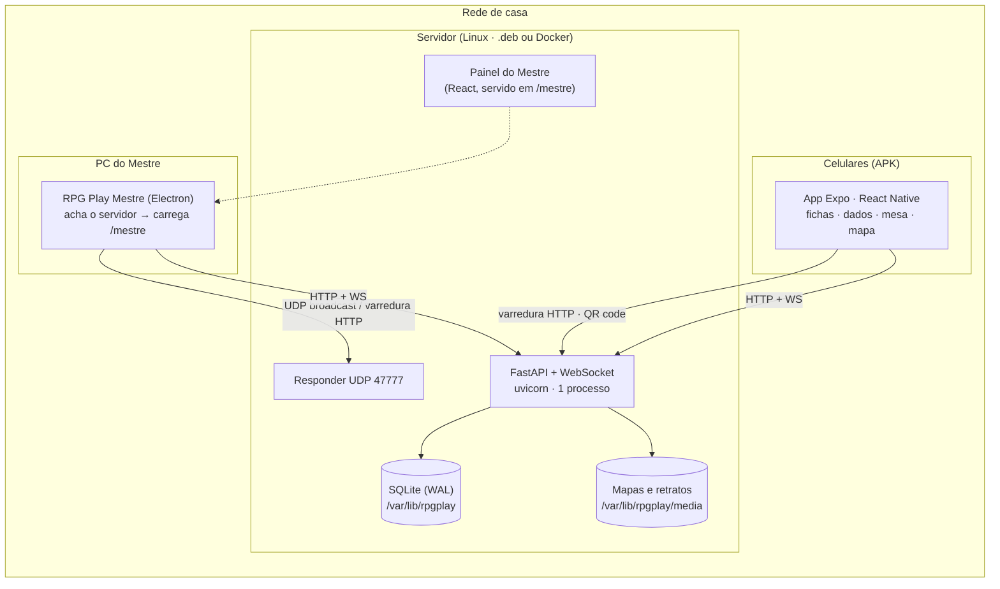
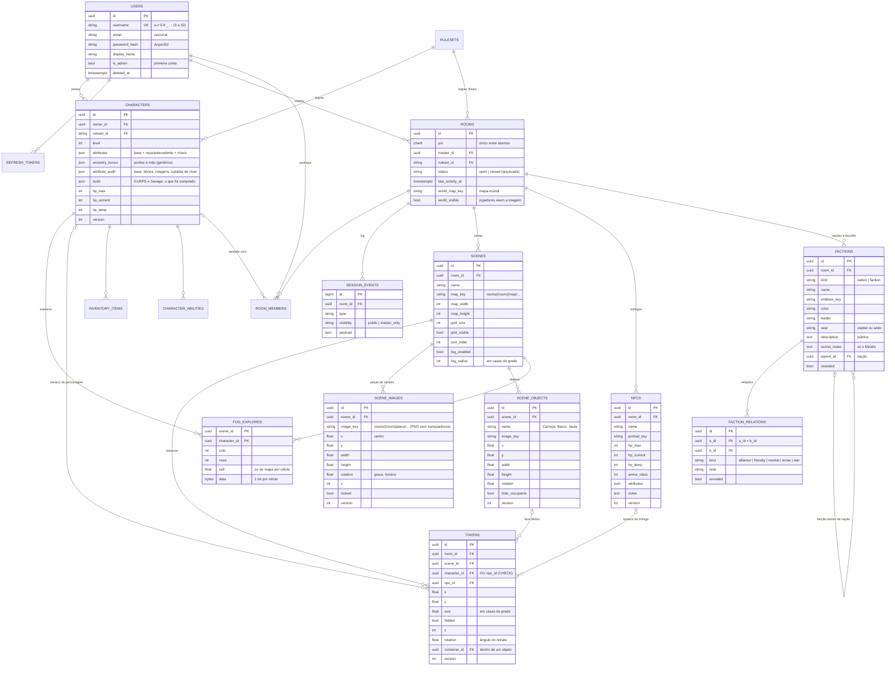
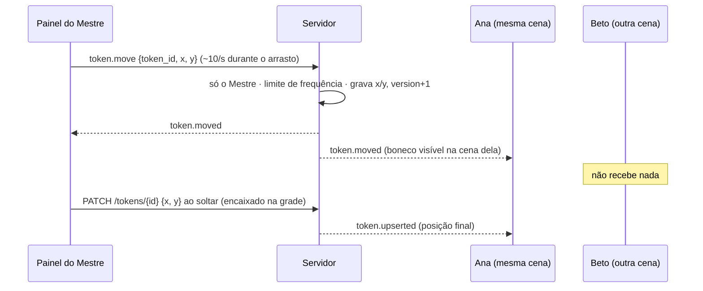
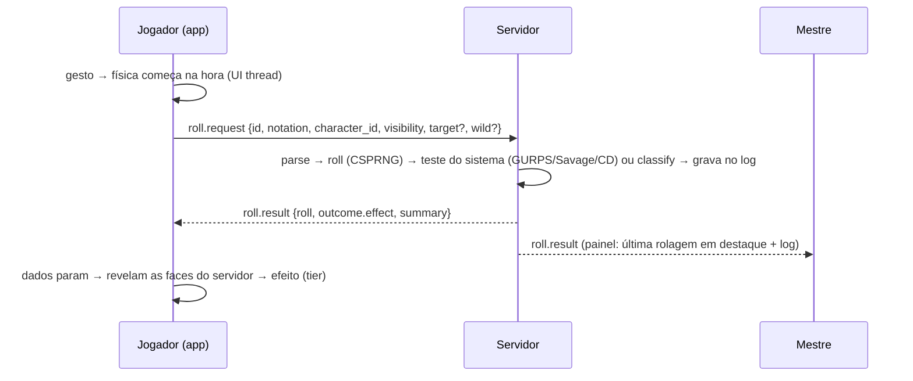

# Arquitetura

## Visão geral



- **Tudo na casa.** Um processo só (uvicorn) com SQLite em modo WAL, mídia em disco e broadcaster em memória. Postgres (`RPG_DATABASE_URL`) e Redis pub/sub (`RPG_REDIS_URL`) continuam suportados, mas não são necessários.
- **O painel do Mestre vem do servidor** (`/mestre`), e o programa do PC só acha o servidor e carrega esse painel. Assim o painel sempre bate com a versão da API, e o mesmo painel abre em qualquer navegador.
- **O servidor é a autoridade** sobre rolagens (CSPRNG `secrets.SystemRandom`), PV (concorrência otimista por `version`) e posição dos bonecos. O cliente só anima.
- **Visões por papel:** o Mestre recebe a mesa inteira; cada jogador recebe só a cena onde está o boneco dele, sem bonecos escondidos e com os inimigos no formato público (nome, imagem, estado vago).
- **O servidor manda chaves, não assets:** `effect = {animation, palette, sound, haptic, shake, particles, crack, light_burst}`. O app mapeia as chaves para componentes e sons locais.
- **Mesma classificação online e offline:** `backend/app/services/dice/outcome.py` e `mobile/src/lib/dice/outcome.ts` passam pelos mesmos casos em `shared/dice-outcome-vectors.json`.

Descoberta, portas e segurança: [REDE_LOCAL.md](REDE_LOCAL.md). Instalação: [INSTALACAO.md](INSTALACAO.md).

## Estrutura de pastas

```
RPG-Play/
├── backend/                  Servidor (Python 3.11+ · FastAPI)
│   ├── app/
│   │   ├── api/v1/           discovery · auth · admin · me · rulesets · characters · rooms · table · dice · uploads · moderation
│   │   ├── core/             config (modo casa: data_dir, segredos gerados) · security (Argon2/JWT) · discovery (UDP) · rate_limit
│   │   ├── db/               Base declarativa, sessão assíncrona (aiosqlite/asyncpg; pragmas WAL no SQLite)
│   │   ├── models/           User, Character, Room, RoomMember, SessionEvent, Scene, Npc, Token, ...
│   │   ├── rulesets/         pacotes SRD 5.1, SRD 5.2.1, Genérico, GURPS 4ª Edição, Savage Worlds + catálogo
│   │   ├── services/         dice/* (notação, dados que explodem, testes) · characters · engines/* (fichas GURPS e Savage) · hp · rooms · table · media · account
│   │   ├── ws/               protocol · router · events · table_events (quem recebe cada evento da mesa) · broadcaster
│   │   ├── main.py           app factory; monta /media e o painel /mestre (fallback de SPA)
│   │   └── server_cli.py     `rpgplay-server`: serve · info · reset-password · make-admin · backup · restore · purge
│   ├── alembic/              migrações (0001 esquema inicial · 0002 servidor caseiro e mesa virtual · 0003 cenário, névoa e mundo · 0004 fichas de pontos), SQLite e Postgres
│   ├── scripts/smoke_test.py teste ponta a ponta contra um servidor no ar
│   └── tests/                pytest (SQLite por padrão; Postgres com RPG_TEST_DATABASE_URL)
├── web/                      Painel do Mestre (Vite · React 19 · MUI · react-konva · TanStack Query · zustand)
│   ├── src/screens/          login · mesas (abertas/arquivadas) · contas (admin)
│   ├── src/table/            mesa virtual: MapCanvas (Konva) · TokenNode · SceneBar · Roster · DetailPanel · LogPanel
│   │                         reducer (eventos do WS) · geometry (grade, zoom) · socket · ConnectDialog (QR)
│   └── e2e/                  Playwright contra o servidor real, com uma jogadora no WebSocket
├── desktop/                  Programa do Mestre (Electron · electron-builder → .exe NSIS e .deb)
│   ├── src/                  main (janela, segurança, menu) · preload (ponte só no launcher) · discovery (UDP + HTTP)
│   ├── launcher/             tela local de escolha do servidor (CSP estrita)
│   └── e2e/                  Playwright + Electron contra o servidor real
├── mobile/                   App dos jogadores (Expo SDK 57 · React Native 0.86)
│   ├── src/app/              server (achar servidor) · scan (QR) · join (link) · (auth)/login · (tabs)/* · character/* · room/*
│   ├── src/components/       hud/HPBar · dice/* (bandeja, testes da ficha) · table/SceneView · wizard/* · build/* (GURPS/Savage) · sheet/*
│   ├── src/lib/              api · ws · discovery (varredura /24, QR) · table (reducer + geometria) · dice/*
│   └── src/state/            session (tokens no Keystore) · server (servidor escolhido)
├── packaging/server/         .deb do servidor: PyInstaller, systemd, server.env, scripts do dpkg, build-deb.sh
├── shared/                   vetores de teste e presets de efeito usados pelo backend e pelo app
├── Dockerfile · docker-compose.yml   alternativa ao .deb (network_mode host)
└── docs/
```

## Modelo de dados



Decisões:
- **Um boneco por personagem por mesa** (índice único parcial `(room_id, character_id)`). Mudar o grupo de cena é trocar o `scene_id`, e a cena de um jogador é a cena do boneco do personagem dele.
- **Inimigos são da mesa**, não da cena. O mesmo inimigo pode ter bonecos em cenas diferentes e é criado em lote ("Goblin" × 3 → Goblin 1, 2, 3).
- **Enums como `VARCHAR`**, e **`JSONB` no Postgres / `JSON` no SQLite.** A migração 0002 usa `batch_alter_table` para funcionar nos dois, e o CI roda `upgrade → check → downgrade → upgrade` em ambos.
- **Campanhas persistentes:** mesas não expiram mais. `closed` = arquivada (dá para reabrir; se o PIN antigo estiver em uso, ganha outro). O expurgo diário apaga campanhas sem atividade há `RPG_ROOM_RETENTION_DAYS` (365 por padrão) e o log com mais de 90 dias.
- **`version`** em personagens, inimigos e bonecos: `hp.change` com versão antiga devolve conflito, e `token.moved` com versão antiga é ignorado pelos clientes (eco atrasado do arrasto).
- **Peças de cenário** (`scene_images`) ficam por baixo da grade e dos bonecos, sobre o mapa de fundo da cena. A imagem é enviada uma vez; peças duplicadas reaproveitam o arquivo, que só é apagado quando nenhuma peça, objeto, cena, inimigo, facção ou mapa-múndi aponta mais para ele.
- **Objetos que carregam** guardam os ocupantes em `tokens.container_id` com posição **absoluta**. Mover ou girar o objeto aplica o mesmo deslocamento/giro (em volta do centro) a cada ocupante, no servidor. Soltar um boneco em cima de um objeto (no painel) coloca dentro; soltar fora tira. Mudar de cena tira do objeto.
- **Quem o jogador vê** (`services/table.py::token_visible`): bonecos escondidos, nunca; dentro de objeto com `hide_occupants`, só o próprio boneco.
- **Névoa de guerra** (`services/fog.py`): a cena vira uma grade de células de meia casa (no máximo 256 por lado). Cada personagem tem um mapa de bits por cena; cada movimento do boneco (arrasto, soltar, colocar, ir junto num objeto) marca tudo a até `fog_radius` casas do **caminho**. Inimigos não exploram. A exploração é gravada mesmo com a névoa desligada, então ligar no meio da sessão já mostra por onde o grupo passou. Mudar o tamanho do mapa ou da grade descarta a exploração (não se encaixa mais).
- **GURPS e Savage Worlds** (`services/engines/`): o pacote diz `engine: "gurps" | "savage"` e traz as listas do livro (`traits`, `skills`). A ficha fica em `characters.build`; o motor valida cada alteração e calcula tudo (pontos gastos, NH, derivadas, Aparar/Resistência, requisitos, avisos) em `character.sheet`, que o app e o painel só exibem. `sheet.checks` são os testes prontos para rolar: GURPS `3d6` com `target` = NH; Savage `1d8!` com `wild` = Dado Selvagem. Depois de pronta, a ficha do GURPS só gasta os pontos que tem (o Mestre dá mais com `experience`) e a do Savage só muda por Progresso (`POST /characters/{id}/advance`), a cada 5 XP. Itens que sumirem do pacote numa versão nova são ignorados na leitura, sem quebrar a ficha.
- **Nível:** `attribute_audit.advancement` soma os pontos ganhos ao subir de nível por cima de base + raça/antecedente; `level_ups` guarda o histórico. Na 5ª edição os PV vêm da classe (média fixa por nível) e o +2 só nos níveis 4, 8, 12, 16 e 19 (até 20); no genérico o jogador informa os PV e soma até 10 pontos por nível.

## Fluxo: o Mestre move um inimigo



## Fluxo: rolagem na mesa



## Protocolo WebSocket (v1)

| Direção | Tipo | Campos |
|---|---|---|
| C→S | `auth` | `token`: **primeira mensagem**, em até 5 s; senão fecha com 4401 |
| C→S | `ping` | resposta `pong` (keepalive a cada 25 s) |
| C→S | `roll.request` | `id`, `notation` (`!` = explode), `character_id?` ou `npc_id?` (só o Mestre), `label?`, `visibility: public\|master_only`, `target?` (NH, dificuldade ou CD), `wild?` (Dado Selvagem) |
| C→S | `hp.change` | `character_id` ou `npc_id` (só o Mestre), `delta`, `kind: damage\|heal\|temp`, `expected_version?` |
| C→S | `token.move` | `token_id`, `x`, `y` (só o Mestre). Personagens exploram a névoa pelo caminho |
| C→S | `object.move` | `object_id`, `x`, `y`, `rotation?` (só o Mestre). Os ocupantes andam junto |
| S→C | `welcome` | `room`, `log` (últimos 50 eventos visíveis), `table` (visão do Mestre ou do jogador) |
| S→C | `roll.result` · `hp.changed` | resultado com `effect` para a animação, `check` (sucesso, margem, ampliações, crítico) e `summary` para o log |
| S→C | `scene.upserted/deleted` · `token.upserted/moved/deleted` · `npc.upserted/deleted` | mesa virtual, filtrada por cena e por papel |
| S→C | `npc.hp.changed` | só para o Mestre (números + log secreto). Os jogadores recebem `npc.upserted` com o estado novo |
| S→C | `image.upserted/deleted` | peças de cenário da cena |
| S→C | `object.upserted/deleted` | objeto e, em `tokens`, os ocupantes que andaram junto (cada jogador recebe só os que vê) |
| S→C | `fog.revealed` · `fog.reset` | células recém-exploradas. O Mestre recebe de todos; o jogador, só as do próprio personagem e só com a névoa ligada |
| S→C | `world.updated` | mapa-múndi, nações, facções e relações. O Mestre recebe tudo; os jogadores, só o revelado (sem notas secretas) |
| S→C | `character.leveled` | alguém subiu de nível, ganhou pontos/XP ou fez um Progresso (`level_label`, PV e o texto do log) |
| S→C | `view.reset` | a visão do jogador mudou (outra cena, névoa ligada, ocupantes escondidos...): vem a visão inteira |
| S→C | `party.updated` | alguém entrou, trocou de personagem ou foi removido |
| S→C | `presence` · `member.kicked` · `room.closed` · `error{code,message,ref}` | |

Códigos de fechamento: `4401` token inválido · `4403` não é membro / foi removido · `4404` mesa não existe · `4410` mesa arquivada. Os clientes reconectam com backoff (0,5 s → 10–15 s), exceto nos códigos finais, e o `welcome` traz o estado atual.

## Classificação de sucesso/falha

1. **Regras do sistema** (`pack.dice.crit_rules`), por exemplo d20 com natural 20 = crítico e 1 = falha crítica.
2. **Crítico genérico** para dados sem regra: todos os dados mantidos no máximo ou no mínimo, desde que a chance seja ≤ 1/6. Por isso d4 e moeda nunca "criticam", e 2d6 em 6-6 critica.
3. **Faixas**: posição relativa do resultado ≤ 20% = `low`, ≥ 80% = `high`, senão `neutral`. Em sistemas roll-under (`direction: low`, ex. d100 percentual) a escala é invertida.
4. `intensity` (0..1) escala os efeitos: tremor, quantidade de confete, volume.
5. **Testes** (`services/dice/check.py`), quando o pedido traz `target` ou `wild`:
   - GURPS: 3d6 ≤ NH. Sucesso decisivo em 3-4 (5 com NH 15+, 6 com NH 16+); falha crítica em 18, em 17 com NH até 15 e em 10+ acima do NH. Decisivo → `critical_success`, sucesso → `high`, falha → `low`.
   - Savage Worlds: dado da característica e Dado Selvagem d6, os dois explodindo; vale o maior + modificador, dificuldade 4, uma ampliação a cada 4 acima. Os dois no 1 = olhos de cobra (`critical_failure`); com ampliação, `critical_success`.
   - Clássico: total ≥ CD, com os críticos do d20.

| Tier | Animação | Paleta | Som | Haptic | Extra |
|---|---|---|---|---|---|
| critical_failure | `die_crack` | blood | impact_dry | error_heavy | tremor 8 px, dado rachado, brasas escuras, vinheta vermelha |
| low | `dim_pulse` | ember | thud_soft | impact_medium | tremor leve |
| neutral | `settle` | stone | clack | impact_light | — |
| high | `glow_soft` | gold_soft | chime | success_light | faíscas |
| critical_success | `golden_burst` | gold | epic_fanfare | success_heavy | explosão de luz, confete |

## Operação

- **Um processo, uma máquina:** o `InMemoryBroadcaster` entrega cada evento às conexões do próprio processo. Com Redis configurado, vários processos podem dividir a carga (útil só fora de casa).
- **Migrações automáticas:** `rpgplay-server serve` roda `alembic upgrade head` antes de subir, então atualizar o `.deb` já migra o banco.
- **Backup consistente** com o servidor ligado (API de backup do SQLite) e **restauração** que guarda os dados anteriores.
- **Expurgo diário** pelo timer systemd `rpgplay-server-purge.timer`.
- **Limites de frequência** em memória (por processo).
