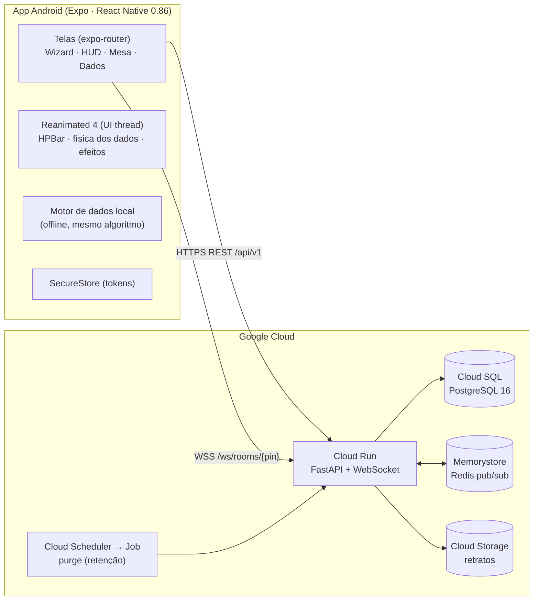
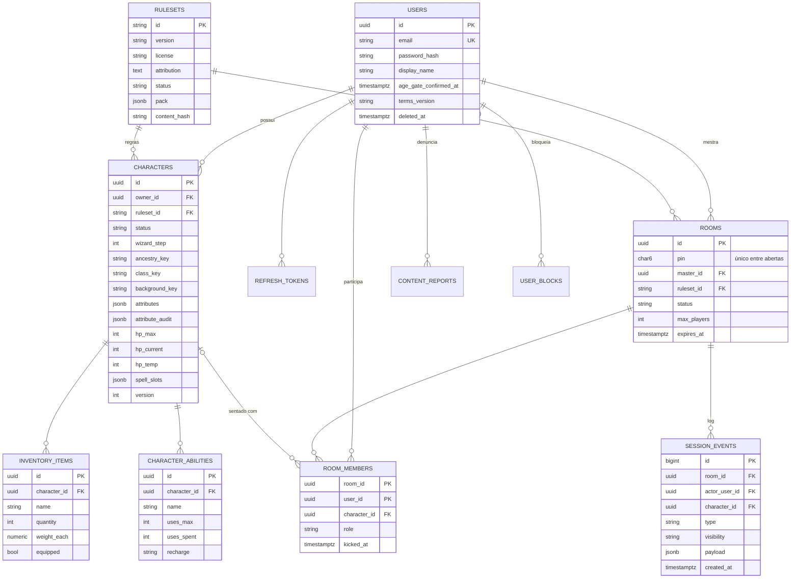
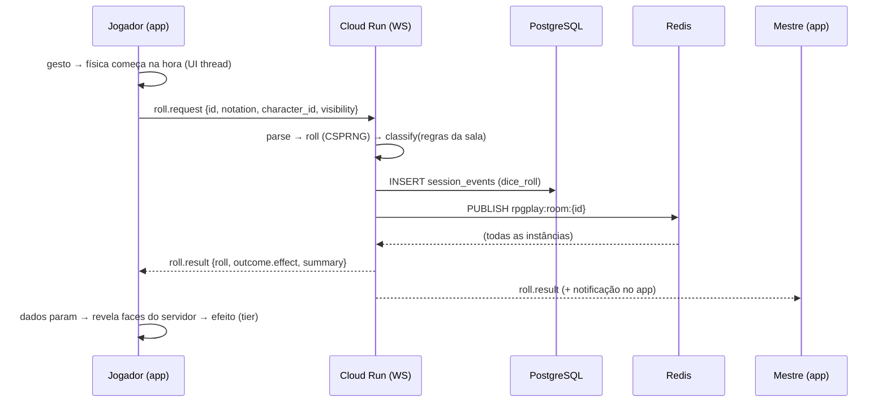

# Arquitetura

## Visão geral



- **O servidor é a autoridade** sobre rolagens em mesa (CSPRNG `secrets.SystemRandom`) e sobre o estado de HP (concorrência otimista por `version`). O cliente só anima.
- **O servidor manda chaves, não assets**: `effect = {animation, palette, sound, haptic, shake, particles, crack, light_burst}`. O app mapeia as chaves para componentes e sons locais, então nenhuma URL arbitrária vem do servidor.
- **Mesma classificação online e offline**: `backend/app/services/dice/outcome.py` e `mobile/src/lib/dice/outcome.ts` passam pelos mesmos casos em `shared/dice-outcome-vectors.json`, e os presets batem com `shared/dice-effects.json`.

## Estrutura de pastas

```
RPG-Play/
├── backend/                  FastAPI (Python 3.12)
│   ├── app/
│   │   ├── api/v1/           auth · me · rulesets · characters · rooms · dice · uploads · moderation
│   │   ├── core/             config (pydantic-settings) · security (Argon2/JWT) · rate_limit · errors
│   │   ├── db/               Base declarativa (JSONB/JSON), sessão assíncrona (asyncpg)
│   │   ├── models/           User, Character, InventoryItem, CharacterAbility, Room, RoomMember,
│   │   │                     SessionEvent, Ruleset, ContentReport, UserBlock
│   │   ├── rulesets/         schema dos pacotes + data/*.json (SRD 5.1, SRD 5.2.1, Genérico, catálogo)
│   │   ├── schemas/          modelos Pydantic de entrada/saída
│   │   ├── services/
│   │   │   ├── dice/         notation (parser) · engine (rolagem) · outcome (tier + efeito)
│   │   │   ├── character_rules.py   atributos, bônus, HP, carga, espaços de magia (puro)
│   │   │   ├── characters.py        wizard, criação expressa, HP, descanso
│   │   │   ├── rooms.py             PIN, entrada, log, expulsão
│   │   │   ├── account.py           exportação, exclusão, expurgo
│   │   │   └── media.py             retrato (EXIF strip) + armazenamento local/GCS
│   │   ├── ws/               protocol · manager (conexões locais) · broadcaster (memória/Redis) · events · router
│   │   ├── main.py           app factory (`uvicorn app.main:create_app --factory`)
│   │   └── cli.py            `python -m app.cli purge`
│   ├── alembic/              migrações (0001: esquema inicial)
│   ├── scripts/smoke_test.py teste ponta a ponta contra uma API no ar
│   └── tests/                pytest (SQLite por padrão; Postgres com RPG_TEST_DATABASE_URL)
├── mobile/                   Expo SDK 57 · TypeScript
│   ├── src/app/              rotas: (auth)/login · (tabs)/{index,dice,rooms,account}
│   │                         character/{new,[id]} · room/{create,[pin]}
│   ├── src/components/
│   │   ├── hud/              HPBar · hpBarLogic · LightParticles
│   │   ├── dice/             DiceTray · physics (worklet) · DieShape (SVG) · OutcomeEffects · DicePicker
│   │   └── wizard/           WizardProgress · OptionList · AttributeStep
│   ├── src/lib/              api · ws (RoomSocket) · dice/* (espelho do backend) · feedback · portrait · queries
│   ├── src/theme/            tokens Material 3 "dark fantasy" + cores do HUD
│   └── __tests__/            Jest: HPBar, lógica da barra, dados (vetores), física, WebSocket
├── shared/                   vetores de teste e presets de efeito usados pelos dois lados
└── docs/
```

## Modelo de dados



Decisões:
- **Enums como `VARCHAR`** (`native_enum=False`): adicionar um valor não exige `ALTER TYPE` numa migração.
- **`JSONB` no Postgres, `JSON` no SQLite**: os testes rodam em SQLite sem dependências, e o CI roda contra Postgres real. `alembic check` garante que os models batem com a migração.
- **Índice único parcial** `uq_rooms_open_pin (pin) WHERE status='open'`: o PIN é curto (32⁶ ≈ 1 bilhão de combinações) e pode voltar a ser usado depois que a sala fecha.
- **`attribute_audit`** guarda método, valores base, bônus e as rolagens de atributo (transparência para o Mestre).
- **`version`** em `characters`: `hp.change` com `expected_version` antigo devolve 409, o que evita o jogador e o Mestre sobrescreverem o dano um do outro.

## Fluxo: rolagem na mesa



A animação começa **antes** da resposta. A resposta leva cerca de 50–150 ms e os dados rolam por 1–2 s, então o jogador não percebe a ida ao servidor. Se a resposta demorar mais que a física, os dados esperam parados, sem face, até o resultado chegar.

## Protocolo WebSocket (v1)

| Direção | Tipo | Campos |
|---|---|---|
| C→S | `auth` | `token`: **primeira mensagem**, em até 5 s. Senão fecha com 4401 |
| C→S | `ping` | resposta `pong` (keepalive a cada 25 s) |
| C→S | `roll.request` | `id`, `notation`, `character_id?`, `label?`, `visibility: public\|master_only` |
| C→S | `hp.change` | `character_id`, `delta`, `kind: damage\|heal\|temp`, `expected_version?` |
| S→C | `welcome` | `room` (membros, HP, online), `log` (últimos 50 eventos visíveis) |
| S→C | `roll.result` | `request_id`, `roll`, `outcome{tier,natural,intensity,effect}`, `actor`, `character`, `summary` |
| S→C | `hp.changed` | `character_id`, `hp_*`, `delta`, `absorbed_by_temp`, `effect: bleed\|shield_hit\|heal_glow\|shield_up`, `version`, `summary` |
| S→C | `presence` · `member.kicked` · `room.closed` · `error{code,message,ref}` | |

Códigos de fechamento: `4401` token inválido · `4403` não é membro / foi removido · `4404` sala não existe · `4410` sala encerrada. O cliente reconecta com backoff exponencial (0,5 s → 15 s, com jitter), exceto nos códigos finais.

Visibilidade: o Mestre recebe **tudo**. Os jogadores recebem os eventos `public`, e uma rolagem `master_only` vai só para o Mestre e para quem rolou (rolagem secreta). O dano aplicado pela ficha fora do WebSocket (`POST /characters/{id}/hp`) também é gravado no log e anunciado para as mesas em que o personagem está.

## Classificação de sucesso/falha

1. **Regras do sistema** (`pack.dice.crit_rules`), por exemplo d20 com natural 20 = crítico e 1 = falha crítica.
2. **Crítico genérico** para dados sem regra: todos os dados mantidos no máximo ou no mínimo, desde que a chance seja ≤ 1/6. Por isso d4 e moeda nunca "criticam", e 2d6 em 6-6 critica.
3. **Faixas**: posição relativa do resultado ≤ 20% = `low`, ≥ 80% = `high`, senão `neutral`. Em sistemas roll-under (`direction: low`, ex. d100 percentual) a escala é invertida.
4. `intensity` (0..1) escala os efeitos: tremor, quantidade de confete, volume.

| Tier | Animação | Paleta | Som | Haptic | Extra |
|---|---|---|---|---|---|
| critical_failure | `die_crack` | blood | impact_dry | error_heavy | tremor 8 px, dado rachado, brasas escuras, vinheta vermelha |
| low | `dim_pulse` | ember | thud_soft | impact_medium | tremor leve |
| neutral | `settle` | stone | clack | impact_light | — |
| high | `glow_soft` | gold_soft | chime | success_light | faíscas |
| critical_success | `golden_burst` | gold | epic_fanfare | success_heavy | explosão de luz, confete |

## Escala e operação

- **Cloud Run** com várias instâncias: o `RedisBroadcaster` distribui cada evento para todas, e cada instância entrega às conexões que mantém. Sem Redis (dev/teste) usa o `InMemoryBroadcaster`.
- As conexões WebSocket duram até o timeout de request do Cloud Run (até 60 min). O cliente reconecta sozinho e recebe `welcome` com o estado atual.
- Rate limit em memória por instância. Para um limite global, troque o `RateLimiter` por um contador no Redis (a interface é a mesma).
- Retenção: `python -m app.cli purge` diário (Cloud Run Job + Cloud Scheduler).
