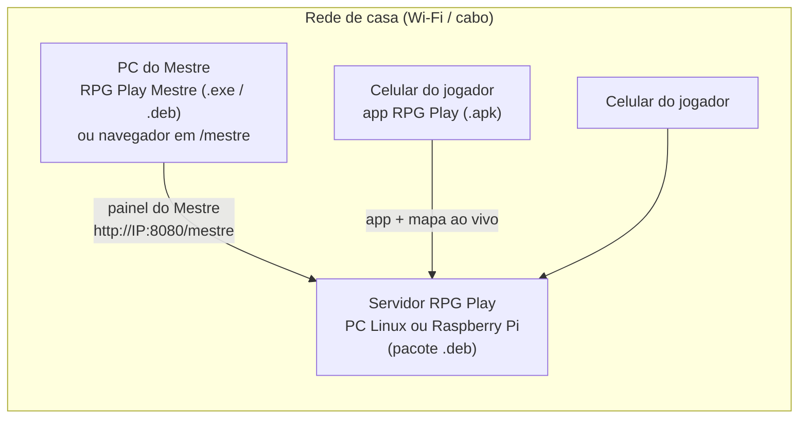

# Instalação na rede de casa

O RPG Play roda inteiro na sua casa, sem nuvem e sem loja de aplicativos:



| Peça | Arquivo | Quem usa |
|---|---|---|
| Servidor | `rpgplay-server_0.2.0_amd64.deb` (PC) ou `_arm64.deb` (Raspberry Pi 64 bits) | Fica ligado num canto da casa |
| Programa do Mestre | `RPG-Play-Mestre-Setup-0.2.0.exe` (Windows) ou `rpgplay-mestre_0.2.0_amd64.deb` (Linux) | O Mestre, no PC |
| App dos jogadores | `RPG-Play-0.2.0.apk` | Cada jogador, no celular Android |

Todos precisam estar **na mesma rede** (o mesmo Wi-Fi ou o mesmo roteador).

## 1. Servidor

### O que precisa

- Um computador que fica ligado durante as sessões: PC velho, notebook ou Raspberry Pi 4/5.
- Linux baseado em Debian/Ubuntu (Debian 11 ou mais novo, Ubuntu 20.04 ou mais novo, Raspberry Pi OS 64 bits, Linux Mint...).
- Uns 300 MB de disco, mais o espaço dos mapas (cada mapa fica com poucos MB).

### Instalar

```bash
sudo apt install ./rpgplay-server_0.2.0_amd64.deb
```

No fim, o instalador mostra os endereços, por exemplo:

```
RPG Play instalado.
  Painel do Mestre (navegador ou app do PC): http://192.168.0.20:8080/mestre
  Celulares (app RPG Play):                  http://192.168.0.20:8080
```

O serviço já fica rodando e sobe sozinho quando o computador liga. Para conferir:

```bash
sudo systemctl status rpgplay-server     # deve mostrar "active (running)"
sudo rpgplay-server info                 # mostra os endereços de novo
```

### Deixe o IP do servidor fixo

No roteador, procure **"Reserva de DHCP"**, "IP fixo" ou "Endereço reservado" e reserve o IP atual do servidor. Assim o endereço não muda, e o app do Mestre e os celulares continuam achando o servidor de primeira.

### Firewall

Se o servidor usa firewall (o `ufw`, por exemplo), libere as duas portas só para a rede de casa:

```bash
sudo ufw allow from 192.168.0.0/16 to any port 8080 proto tcp
sudo ufw allow from 192.168.0.0/16 to any port 47777 proto udp
```

- **8080/TCP**: app dos celulares e painel do Mestre.
- **47777/UDP**: descoberta automática (os aparelhos perguntam "tem servidor RPG Play aí?" e o servidor responde).

> **Não abra a porta 8080 no roteador para a internet.** O servidor foi feito para a rede de casa e fala HTTP sem criptografia.

### Configurar

O arquivo é `/etc/rpgplay/server.env`:

```bash
sudo nano /etc/rpgplay/server.env
sudo systemctl restart rpgplay-server
```

| Opção | Para que serve |
|---|---|
| `RPG_SERVER_NAME="Mesa do Pedro"` | Nome que aparece nos celulares e no programa do Mestre |
| `RPG_ALLOW_REGISTRATION=false` | Fecha o cadastro depois que todo mundo criou a conta |
| `RPG_PORT=8080` | Porta (se mudar, libere a nova no firewall) |

### Primeira conta = administrador

**A primeira conta criada no servidor vira administrador.** Por isso o Mestre cria a conta dele primeiro, pelo programa do PC ou pelo navegador em `http://IP-DO-SERVIDOR:8080/mestre`. O administrador pode redefinir a senha de qualquer um no painel (ícone de contas, no alto da lista de mesas).

### Raspberry Pi

Use o **Raspberry Pi OS de 64 bits** e o pacote `_arm64.deb`. Com o Pi ligado por cabo no roteador, a mesa fica mais estável.

### Alternativa: Docker

Quem já usa Docker no servidor pode subir o mesmo sistema com o `docker-compose.yml` da raiz do projeto:

```bash
docker compose up -d --build
docker compose exec rpgplay python -m app.server_cli info
```

O compose usa `network_mode: host` para a descoberta automática (UDP) funcionar. Os dados ficam no volume `rpgplay-data`.

## 2. Programa do Mestre (PC)

### Windows

1. Rode `RPG-Play-Mestre-Setup-0.2.0.exe`.
2. O Windows pode avisar "O Windows protegeu o computador" (o instalador não tem certificado pago de assinatura). Clique em **Mais informações → Executar assim mesmo**.
3. Escolha a pasta e conclua. O atalho "RPG Play Mestre" aparece no menu Iniciar e na área de trabalho.
4. Se o Firewall do Windows perguntar, permita o acesso em **redes privadas** (é assim que ele acha o servidor).

### Linux

```bash
sudo apt install ./rpgplay-mestre_0.2.0_amd64.deb
```

O "RPG Play Mestre" aparece no menu de aplicativos.

### Usar

Ao abrir, o programa procura o servidor na rede e já entra no painel do Mestre. Se tiver mais de um servidor, ou se o roteador bloquear a busca, ele mostra a lista e um campo para digitar o endereço (`192.168.0.20` ou `192.168.0.20:8080`). Da próxima vez, ele abre direto no último servidor. Para trocar: menu **Mesa → Trocar servidor**.

> **Sem instalar nada:** o painel também abre em qualquer navegador do PC, em `http://IP-DO-SERVIDOR:8080/mestre`.

## 3. App dos jogadores (Android)

### Instalar o APK

1. Passe o arquivo `RPG-Play-0.2.0.apk` para o celular (WhatsApp, cabo USB, Google Drive, pendrive...).
2. Toque no arquivo. O Android pede para **permitir a instalação de apps desta fonte**: autorize para o app que você usou para abrir o arquivo (Arquivos, Chrome, WhatsApp...).
3. Se o **Play Protect** avisar que o app é desconhecido, toque em **Mais detalhes → Instalar mesmo assim**. Isso aparece porque o app não veio da Play Store.

### Conectar

Na primeira abertura, o app procura o servidor no Wi-Fi. Há três jeitos de conectar:

- **Toque no servidor encontrado** (ex.: "Mesa do Pedro").
- **Ler QR code do Mestre**: no painel, o Mestre clica em **Conectar celulares**, e o QR code configura o servidor e já entra na mesa depois do login.
- **Digitar o endereço** que aparece no painel (ex.: `192.168.0.20:8080`).

Depois, cada jogador cria a própria conta (usuário e senha), cria o personagem e entra na mesa.

## 4. Primeira sessão, passo a passo

1. **Mestre (PC):** cria a conta, clica em **Nova mesa**, escolhe o sistema de regras e dá um nome à campanha.
2. **Mestre:** **Criar cena com mapa**, solta a imagem do mapa e ajusta a grade até bater com os quadradinhos do desenho.
3. **Jogadores (celular):** criam conta e personagem (criação expressa em um toque ou passo a passo) e leem o QR code de **Conectar celulares**.
4. **Mestre:** os personagens aparecem na aba **Grupo**. Arraste cada um para o mapa (ou use **Trazer o grupo todo para esta cena**).
5. **Mestre:** na aba **Inimigos**, **Novo inimigo**, com imagem, PV, CA, atributos e quantidade ("Goblin" × 3 vira Goblin 1, 2 e 3). Arraste para o mapa. Botão direito → **Esconder dos jogadores** para montar uma emboscada.
6. **Jogadores:** a aba **Mapa**, dentro da mesa no celular, mostra a cena onde está o personagem de cada um. Os bonecos andam em tempo real quando o Mestre arrasta.
7. **Durante o combate:** clique num boneco para ver os atributos ao vivo, aplicar dano ou cura e rolar por ele. Com inimigos, os números ficam só com o Mestre: os jogadores veem "Ileso", "Ferido", "Muito ferido" ou "Caído".
8. **O grupo se separou?** Crie outra cena ("Caverna") e mova quem foi para lá (botão direito no boneco → **Mover para a cena**). Cada jogador passa a ver só o mapa de onde está.
9. **Fim da sessão:** tudo fica salvo. Na lista de mesas, **Arquivar** guarda a campanha, e **Reabrir campanha** volta de onde parou.

## 5. Dia a dia do servidor

| Tarefa | Comando |
|---|---|
| Alguém esqueceu a senha | `sudo rpgplay-server reset-password <usuário>` (gera uma senha nova) ou pelo painel do admin |
| Tornar alguém administrador | `sudo rpgplay-server make-admin <usuário>` |
| Backup (banco + mapas + retratos) | `sudo rpgplay-server backup ~/rpgplay-backup.tar.gz` |
| Restaurar um backup | `sudo rpgplay-server restore ~/rpgplay-backup.tar.gz` (para o serviço, restaura e religa; os dados anteriores ficam em `/var/lib/rpgplay/antes-da-restauracao-*`) |
| Ver o que está acontecendo | `journalctl -u rpgplay-server -f` |
| Atualizar | `sudo apt install ./rpgplay-server_<versão nova>_amd64.deb` (os dados e a configuração ficam; o banco é migrado sozinho) |
| Desinstalar (mantendo as campanhas) | `sudo apt remove rpgplay-server` |
| Apagar tudo, inclusive as campanhas | `sudo apt purge rpgplay-server` |

Dica: guarde o backup fora do servidor (pendrive ou outro PC) de vez em quando.

## 6. Problemas comuns

| Sintoma | O que fazer |
|---|---|
| O app ou o programa do PC não acha o servidor | Confira se todos estão no **mesmo Wi-Fi**. Desligue **VPN** e "Wi-Fi privado"/"endereço aleatório" que bloqueiem a rede local. Veja se o roteador **não isola os aparelhos** ("isolamento de clientes", "AP isolation" ou rede de convidados). Se não der, digite o IP do servidor à mão. |
| Achava e parou de achar | O IP do servidor mudou: faça a reserva de DHCP (seção 1) e escolha o servidor de novo |
| "Sem conexão com o servidor" | Servidor desligado ou serviço parado: `sudo systemctl restart rpgplay-server` |
| Firewall do servidor bloqueando | Libere 8080/TCP e 47777/UDP (seção 1) |
| O jogador não vê o mapa | O Mestre ainda não colocou o personagem dele numa cena (aba Grupo → arrastar para o mapa) |
| O jogador vê um inimigo sumir | O Mestre escondeu o boneco ou o levou para outra cena |
| "Cadastro fechado" | `RPG_ALLOW_REGISTRATION=true` no `server.env` e reinicie o serviço |
| O painel mostra "Painel do Mestre não foi instalado" | Servidor rodando a partir do código-fonte sem o painel compilado: `cd web && npm ci && npm run build` |

## 7. Gerar os instaladores

Para quem mexe no código. Cada parte tem teste automatizado; veja o `README.md`.

### Pelo GitHub Actions (todos de uma vez)

Crie uma tag de versão e envie:

```bash
git tag v0.2.0 && git push origin v0.2.0
```

O workflow **Release** (`.github/workflows/release.yml`) gera os `.deb` do servidor (amd64 e arm64), o `.exe` e o `.deb` do Mestre e o APK, e anexa tudo a um Release. Pela aba Actions também dá para rodar manualmente e baixar os arquivos.

**Chave de assinatura do APK (uma vez só):** o Android só atualiza um app se a nova versão tiver a mesma assinatura. Gere uma chave, guarde-a bem e cadastre nos *secrets* do repositório:

```bash
keytool -genkeypair -v -keystore rpgplay.jks -alias rpgplay -keyalg RSA -keysize 4096 -validity 10000
base64 -w0 rpgplay.jks   # vira o secret ANDROID_KEYSTORE_BASE64
```

Secrets: `ANDROID_KEYSTORE_BASE64`, `ANDROID_KEYSTORE_PASSWORD`, `ANDROID_KEY_ALIAS` (`rpgplay`) e `ANDROID_KEY_PASSWORD`.

### Na sua máquina

| O quê | Comando | Precisa de |
|---|---|---|
| Servidor `.deb` | `packaging/server/build-deb.sh` | Node 22, Python 3.11+, `dpkg-deb`. Para o pacote rodar em distros antigas, use um Python portátil: `PYTHON=$(uv python find 3.12) packaging/server/build-deb.sh` |
| Mestre `.deb` | `cd desktop && npm ci && npm run dist:linux` | Node 22 |
| Mestre `.exe` | `cd desktop && npm ci && npm run dist:win` | Windows, ou Linux com `wine` (32 e 64 bits) |
| APK | `cd mobile && npm ci && npm run apk` | Android SDK + JDK 17. Sai em `mobile/android/app/build/outputs/apk/release/` |
| APK pela nuvem da Expo | `cd mobile && npx eas-cli build -p android --profile apk` | Conta gratuita na Expo |
