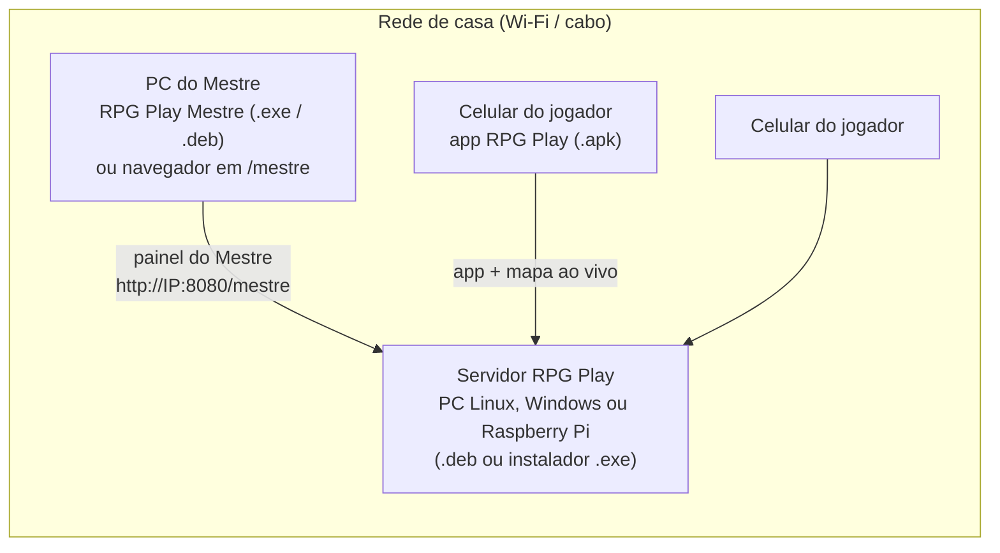
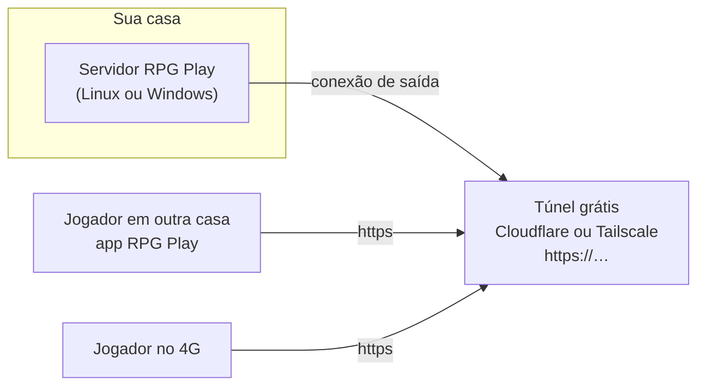

# Instalação na rede de casa

O RPG Play roda inteiro na sua casa, sem nuvem e sem loja de aplicativos:


```mermaid
flowchart LR
  subgraph Casa["Rede de casa (Wi-Fi / cabo)"]
    S["Servidor RPG Play<br/>PC Linux, Windows ou Raspberry Pi<br/>(.deb ou instalador .exe)"]
    M["PC do Mestre<br/>RPG Play Mestre (.exe / .deb)<br/>ou navegador em /mestre"]
    J1["Celular do jogador<br/>app RPG Play (.apk)"]
    J2["Celular do jogador"]
  end
  M -- "painel do Mestre<br/>http://IP:8080/mestre" --> S
  J1 -- "app + mapa ao vivo" --> S
  J2 --> S
```

| Peça | Arquivo | Quem usa |
|---|---|---|
| Servidor | `rpgplay-server_0.5.1_amd64.deb` (PC Linux), `_arm64.deb` (Raspberry Pi 64 bits) ou `RPG-Play-Servidor-Setup-0.5.1.exe` (Windows) | Fica ligado durante as sessões (pode ser o próprio PC do Mestre) |
| Programa do Mestre | `RPG-Play-Mestre-Setup-0.5.1.exe` (Windows) ou `rpgplay-mestre_0.5.1_amd64.deb` (Linux) | O Mestre, no PC |
| App dos jogadores | `RPG-Play-0.5.1.apk` | Cada jogador, no celular Android |

Baixe todos na página **[Releases](https://github.com/PedroASenna/Ficha-de-Personagem-de-RPG/releases/latest)** do projeto.

Todos precisam estar **na mesma rede** (o mesmo Wi-Fi ou o mesmo roteador). Quem está longe também pode jogar: o servidor abre um link **https pela internet, de graça**, sem mexer no roteador (seção 5).

## 1. Servidor

### O que precisa

- Um computador que fica ligado durante as sessões: PC velho, notebook ou Raspberry Pi 4/5. Pode ser o próprio PC do Mestre.
- Linux baseado em Debian/Ubuntu (Debian 11 ou mais novo, Ubuntu 20.04 ou mais novo, Raspberry Pi OS 64 bits, Linux Mint...) **ou Windows 10/11 (64 bits)**: veja [Servidor no Windows](#servidor-no-windows).
- Uns 300 MB de disco, mais o espaço dos mapas (cada mapa fica com poucos MB).

### Instalar

```bash
sudo apt install ./rpgplay-server_0.5.1_amd64.deb
```

No fim, o instalador mostra os endereços, por exemplo:

```
RPG Play instalado.
  Painel do Mestre (navegador ou app do PC): http://192.168.0.20:8080/mestre
  Celulares (app RPG Play):                  http://192.168.0.20:8080
```

O serviço já fica rodando e sobe sozinho quando o computador liga. Para conferir:

```bash
sudo systemctl status rpgplay-server     # deve mostrar "active (running)"
sudo rpgplay-server info                 # mostra os endereços de novo
```

### Deixe o IP do servidor fixo

No roteador, procure **"Reserva de DHCP"**, "IP fixo" ou "Endereço reservado" e reserve o IP atual do servidor. Assim o endereço não muda, e o app do Mestre e os celulares continuam achando o servidor de primeira.

### Firewall

Muitos Linux vêm com firewall ligado (o Debian e o Ubuntu costumam usar o `ufw`; o Fedora e o openSUSE, o `firewalld`). Com ele ativo, **os celulares não conseguem conectar** até você liberar as portas. O instalador avisa, e um comando resolve:

```bash
sudo rpgplay-server liberar-firewall
```

Ele detecta o ufw ou o firewalld e libera as duas portas **só para a rede de casa** (ex.: `192.168.0.0/24`). Nunca libera para "qualquer origem": muitos computadores têm IPv6 público, e aí a porta ficaria aberta para a internet.

- **8080/TCP**: app dos celulares e painel do Mestre.
- **47777/UDP**: descoberta automática (os aparelhos perguntam "tem servidor RPG Play aí?" e o servidor responde).

Para conferir tudo de uma vez (servidor rodando, endereço para os celulares, firewall):

```bash
sudo rpgplay-server diagnostico
```

Se preferir liberar à mão:

- **ufw:**
  ```bash
  sudo ufw allow from 192.168.0.0/24 to any port 8080 proto tcp
  sudo ufw allow from 192.168.0.0/24 to any port 47777 proto udp
  ```
- **firewalld:** use `firewall-cmd --permanent --add-rich-rule='rule family="ipv4" source address="192.168.0.0/24" port port="8080" protocol="tcp" accept'`, repita com `47777`/`udp` e rode `firewall-cmd --reload`.

Troque `192.168.0.0/24` pela rede da sua casa, que o `diagnostico` mostra.

> **Não abra a porta 8080 no roteador para a internet.** O servidor foi feito para a rede de casa e fala HTTP sem criptografia.

### Configurar

O arquivo é `/etc/rpgplay/server.env`:

```bash
sudo nano /etc/rpgplay/server.env
sudo systemctl restart rpgplay-server
```

| Opção | Para que serve |
|---|---|
| `RPG_SERVER_NAME="Mesa do Pedro"` | Nome que aparece nos celulares e no programa do Mestre |
| `RPG_ALLOW_REGISTRATION=false` | Fecha o cadastro depois que todo mundo criou a conta |
| `RPG_PORT=8080` | Porta (se mudar, libere a nova no firewall) |

### Primeira conta = administrador

**A primeira conta criada no servidor vira administrador.** Por isso o Mestre cria a conta dele primeiro, pelo programa do PC ou pelo navegador em `http://IP-DO-SERVIDOR:8080/mestre`. O administrador pode redefinir a senha de qualquer um no painel (ícone de contas, no alto da lista de mesas).

### Raspberry Pi

Use o **Raspberry Pi OS de 64 bits** e o pacote `_arm64.deb`. Com o Pi ligado por cabo no roteador, a mesa fica mais estável.

### Servidor no Windows

Para quem não tem um Linux em casa: o servidor roda também no Windows 10/11 de 64 bits, inclusive no mesmo PC em que o Mestre usa o programa do Mestre.

1. Baixe `RPG-Play-Servidor-Setup-<versão>.exe` em [Releases](https://github.com/PedroASenna/Ficha-de-Personagem-de-RPG/releases/latest) e abra. O Windows pode avisar "O Windows protegeu o computador" (o instalador não tem assinatura paga): clique em **Mais informações → Executar assim mesmo**.
2. O instalador pede permissão de administrador para:
   - instalar em `Arquivos de Programas\RPG Play Servidor`;
   - liberar o servidor no **Firewall do Windows só para a rede local** (celulares da casa entram; ninguém de fora);
   - criar os atalhos do menu Iniciar.

   Deixe marcado **"Abrir o servidor junto com o Windows"** se esse PC vai ser sempre o servidor: ele liga sozinho, minimizado na barra de tarefas.
3. Abra **RPG Play Servidor** no menu Iniciar. Aparece uma janela com os endereços, por exemplo:

   ```
   RPG Play: Mesa de RPG
     jogadores (app):   http://192.168.0.20:8080
     Mestre (navegador): http://192.168.0.20:8080/mestre

   Deixe esta janela aberta enquanto jogam. Para desligar o servidor, feche a janela.
   ```

   **Enquanto a janela estiver aberta, a mesa funciona.** Fechou, desligou (as campanhas ficam salvas).

No menu Iniciar, na pasta **RPG Play Servidor**, também ficam:

| Atalho | Para quê |
|---|---|
| Diagnóstico de rede | O celular não conecta? Confere se o servidor está aberto, mostra o endereço e se o firewall está liberado |
| Liberar no firewall | Refaz a liberação no Firewall do Windows (pede administrador) |
| Pasta das campanhas | `C:\ProgramData\RPG Play\servidor`: banco, mapas, retratos e o arquivo de configuração `servidor.env` (nome da mesa, porta, cadastro aberto) |
| Painel do Mestre (navegador) | Abre `http://localhost:8080/mestre` |

Dicas:
- Deixe o PC **sem hibernar** durante a sessão (Configurações → Sistema → Energia).
- A mesma pasta de campanhas vale para qualquer usuário do PC. Para mudar o nome da mesa ou fechar o cadastro, edite `servidor.env` e abra o servidor de novo.
- Os comandos do Linux também existem aqui. Abra o Prompt de Comando na pasta do programa (`C:\Program Files\RPG Play Servidor`) e use `rpgplay-server.exe`, por exemplo: `rpgplay-server.exe reset-password fulano` ou `rpgplay-server.exe backup C:\Users\voce\Desktop\rpgplay-backup.tar.gz`. Os backups são os mesmos do Linux, então dá para levar a campanha do Windows para um servidor Linux e vice-versa.
- **Atualizar:** baixe o instalador novo e instale por cima. O servidor aberto é fechado, e as campanhas continuam.
- **Desinstalar:** Configurações → Aplicativos → RPG Play Servidor. As campanhas ficam, a não ser que você responda **Sim** para apagá-las.

### Alternativa: Docker

Quem já usa Docker no servidor pode subir o mesmo sistema com o `docker-compose.yml` da raiz do projeto:

```bash
docker compose up -d --build
docker compose exec rpgplay python -m app.server_cli info
```

O compose usa `network_mode: host` para a descoberta automática (UDP) funcionar. Os dados ficam no volume `rpgplay-data`.

## 2. Programa do Mestre (PC)

### Windows

1. Rode `RPG-Play-Mestre-Setup-0.5.1.exe`.
2. O Windows pode avisar "O Windows protegeu o computador" (o instalador não tem certificado pago de assinatura). Clique em **Mais informações → Executar assim mesmo**.
3. Escolha a pasta e conclua. O atalho "RPG Play Mestre" aparece no menu Iniciar e na área de trabalho.
4. Se o Firewall do Windows perguntar, permita o acesso em **redes privadas** (é assim que ele acha o servidor).

### Linux

```bash
sudo apt install ./rpgplay-mestre_0.5.1_amd64.deb
```

O "RPG Play Mestre" aparece no menu de aplicativos.

### Usar

Ao abrir, o programa procura o servidor na rede e já entra no painel do Mestre. Se tiver mais de um servidor, ou se o roteador bloquear a busca, ele mostra a lista e um campo para digitar o endereço (`192.168.0.20` ou `192.168.0.20:8080`). Da próxima vez, ele abre direto no último servidor. Para trocar: menu **Mesa → Trocar servidor**.

> **Sem instalar nada:** o painel também abre em qualquer navegador do PC, em `http://IP-DO-SERVIDOR:8080/mestre`.

## 3. App dos jogadores (Android)

### Instalar o APK

1. Passe o arquivo `RPG-Play-0.5.1.apk` para o celular (WhatsApp, cabo USB, Google Drive, pendrive...).
2. Toque no arquivo. O Android pede para **permitir a instalação de apps desta fonte**: autorize para o app que você usou para abrir o arquivo (Arquivos, Chrome, WhatsApp...).
3. Se o **Play Protect** avisar que o app é desconhecido, toque em **Mais detalhes → Instalar mesmo assim**. Isso aparece porque o app não veio da Play Store.

### Conectar

Na primeira abertura, o app procura o servidor no Wi-Fi. Há três jeitos de conectar:

- **Toque no servidor encontrado** (ex.: "Mesa do Pedro").
- **Ler QR code do Mestre**: no painel, o Mestre clica em **Conectar celulares**, e o QR code configura o servidor e já entra na mesa depois do login.
- **Digitar o endereço** que aparece no painel (ex.: `192.168.0.20:8080`).

Depois, cada jogador cria a própria conta (usuário e senha), cria o personagem e entra na mesa.

## 4. Primeira sessão, passo a passo

1. **Mestre (PC):** cria a conta, clica em **Nova mesa**, escolhe o sistema de regras e dá um nome à campanha.
2. **Mestre:** **Criar cena com mapa**, solta a imagem do mapa e ajusta a grade até bater com os quadradinhos do desenho.
3. **Jogadores (celular):** criam conta e personagem (criação expressa em um toque ou passo a passo) e leem o QR code de **Conectar celulares**.
4. **Mestre:** os personagens aparecem na aba **Grupo**. Arraste cada um para o mapa (ou use **Trazer o grupo todo para esta cena**).
5. **Mestre:** na aba **Inimigos**, **Novo inimigo**, com imagem, PV, CA, atributos e quantidade ("Goblin" × 3 vira Goblin 1, 2 e 3). Arraste para o mapa. Botão direito → **Esconder dos jogadores** para montar uma emboscada.
6. **Jogadores:** a aba **Mapa**, dentro da mesa no celular, mostra a cena onde está o personagem de cada um. Os bonecos andam em tempo real quando o Mestre arrasta.
7. **Durante o combate:** clique num boneco para ver os atributos ao vivo, aplicar dano ou cura e rolar por ele. Com inimigos, os números ficam só com o Mestre: os jogadores veem "Ileso", "Ferido", "Muito ferido" ou "Caído".
8. **O grupo se separou?** Crie outra cena ("Caverna") e mova quem foi para lá (botão direito no boneco → **Mover para a cena**). Cada jogador passa a ver só o mapa de onde está.
9. **Fim da sessão:** tudo fica salvo. Na lista de mesas, **Arquivar** guarda a campanha, e **Reabrir campanha** volta de onde parou.

## 5. Jogar pela internet (de graça)

Quem está em outra casa joga pelo celular, com o servidor ligado na sua. Não precisa abrir portas no roteador e funciona até em internet com CGNAT (a maioria das operadoras de celular e fibra).


```mermaid
flowchart LR
  subgraph Casa["Sua casa"]
    S["Servidor RPG Play<br/>(Linux ou Windows)"]
  end
  T["Túnel grátis<br/>Cloudflare ou Tailscale<br/>https://…"]
  L1["Jogador em outra casa<br/>app RPG Play"]
  L2["Jogador no 4G"]
  S -- "conexão de saída" --> T
  L1 -- "https" --> T
  L2 -- "https" --> T
```

**Ligar (uma vez, pelo painel do Mestre):**

1. Entre no painel com a conta de administrador (a primeira criada no servidor).
2. Na lista de mesas, clique no **globo** (Internet) e escolha **Link rápido (Cloudflare)**.
3. Espere a situação ficar **No ar**. Na primeira vez o servidor baixa o programa da Cloudflare (uns 40 MB).
4. Pronto: aparece o **link** (`https://…trycloudflare.com`).

**Convidar quem está longe:**

1. Abra a mesa e clique em **Conectar celulares → Pela internet**.
2. Clique em **Copiar convite** e mande no grupo (WhatsApp, Discord...). O convite traz um link `https://…/entrar?pin=…`. No celular, o botão **Abrir no app RPG Play** configura o servidor no app.
3. O jogador entra ou cria a conta e, se quiser, já cria o personagem. A conta não depende de mesa: o PIN do convite fica guardado na aba **Mesas**.
4. Quando quiser, o jogador toca em **Entrar** na aba Mesas e fica na **sala de espera**.
5. Na mesa aparece uma faixa "Fulano quer entrar na mesa pela internet": **Aceitar** ou **Recusar**.

**As duas opções de link:**

| | Link rápido (Cloudflare) | Link fixo (Tailscale) |
|---|---|---|
| Conta | Nenhuma | Conta grátis no Tailscale (Google, Microsoft, GitHub...) |
| O link | Muda sempre que o servidor ou o PC reinicia (o novo aparece no painel) | Nunca muda (`https://nome-do-pc.algo.ts.net`) |
| Preparar | Nada | Uma vez: instalar o Tailscale e rodar um comando (abaixo) |
| Limites | Serviço de teste da Cloudflare, sem garantia; até 200 requisições ao mesmo tempo (sobra para uma mesa) | Uso pessoal grátis do Tailscale |

**Link fixo, passo a passo (uma vez):**

1. Instale o Tailscale no computador do servidor: [tailscale.com/download](https://tailscale.com/download). No Linux: `curl -fsSL https://tailscale.com/install.sh | sh`.
2. **Linux:** `sudo rpgplay-server internet fixo`. **Windows:** menu Iniciar → RPG Play Servidor → **Link fixo pela internet (Tailscale)**.
3. Na primeira vez o Tailscale mostra um link para entrar na conta e outro para ativar o **Funnel**: abra os dois no navegador e confirme.
4. No painel, no globo (Internet), escolha **Link fixo (Tailscale)**. Se ainda aparecer problema, clique em **Conferir de novo**.

Para desligar o link fixo: `sudo rpgplay-server internet desligar-fixo` (Linux) ou escolha **Desligado** no painel.

**Segurança (o que muda com a internet ligada):**

- Criar conta e personagem é livre para quem tem o link; **entrar numa mesa** depende da sua aprovação. Quer fechar mais? No globo (Internet), ligue **Pedir código de acesso para criar conta pela internet**: o código (ex.: `K7QD-M2XP`) passa a ir no convite e só quem tem o código cria conta. Troque o código se ele vazar (quem já tem conta continua entrando).
- A primeira conta do servidor (a do administrador) só pode ser criada na rede de casa.
- As mesas abertas passam a **pedir aprovação** para quem entra pelo PIN (**Aprovar entrada**, em Conectar celulares). O Mestre pode desligar isso em cada mesa.
- Tudo pela internet vai criptografado (https). Os IPs da sua casa não aparecem para quem está fora.
- Limites contra força bruta: cadastro por IP e login por conta.
- Desligou no painel, acabou: o túnel fecha e o cadastro pela internet para de funcionar.

**Ver o link e o código no terminal:** `sudo rpgplay-server internet` (Linux) ou menu Iniciar → **Jogar pela internet (link e código)** (Windows).

## 6. Dia a dia do servidor

| Tarefa | Comando |
|---|---|
| O celular não conecta | `sudo rpgplay-server diagnostico` mostra o que está errado; `sudo rpgplay-server liberar-firewall` resolve o caso mais comum (firewall) |
| Ver o link e o código de acesso da internet | `sudo rpgplay-server internet` |
| Alguém esqueceu a senha | `sudo rpgplay-server reset-password <usuário>` (gera uma senha nova) ou pelo painel do admin |
| Tornar alguém administrador | `sudo rpgplay-server make-admin <usuário>` |
| Backup (banco + mapas + retratos) | `sudo rpgplay-server backup ~/rpgplay-backup.tar.gz` |
| Restaurar um backup | `sudo rpgplay-server restore ~/rpgplay-backup.tar.gz` (para o serviço, restaura e religa; os dados anteriores ficam em `/var/lib/rpgplay/antes-da-restauracao-*`) |
| Ver o que está acontecendo | `journalctl -u rpgplay-server -f` |
| Atualizar | `sudo apt install ./rpgplay-server_<versão nova>_amd64.deb` (os dados e a configuração ficam; o banco é migrado sozinho) |
| Desinstalar (mantendo as campanhas) | `sudo apt remove rpgplay-server` |
| Apagar tudo, inclusive as campanhas | `sudo apt purge rpgplay-server` |

Dica: guarde o backup fora do servidor (pendrive ou outro PC) de vez em quando.

## 7. Problemas comuns

| Sintoma | O que fazer |
|---|---|
| O app ou o programa do PC não acha o servidor | **Primeiro teste:** abra `http://IP-DO-SERVIDOR:8080/api/v1/discovery` no navegador do celular. Se não abrir, no servidor rode `sudo rpgplay-server diagnostico`: quase sempre é o **firewall**, e `sudo rpgplay-server liberar-firewall` resolve. Depois, confira se todos estão no **mesmo Wi-Fi**. Desligue **VPN** e "Wi-Fi privado"/"endereço aleatório" que bloqueiem a rede local. Veja se o roteador **não isola os aparelhos** ("isolamento de clientes", "AP isolation" ou rede de convidados). Se não der, digite o IP do servidor à mão. |
| Achava e parou de achar | O IP do servidor mudou: faça a reserva de DHCP (seção 1) e escolha o servidor de novo |
| "Sem conexão com o servidor" | Servidor desligado ou serviço parado: `sudo systemctl restart rpgplay-server`. No Windows: a janela do servidor foi fechada ou o PC hibernou; abra **RPG Play Servidor** no menu Iniciar |
| Servidor no Windows e o celular não conecta | Menu Iniciar → RPG Play Servidor → **Diagnóstico de rede**. Se faltar a regra do firewall, use **Liberar no firewall**. Se, ao abrir o servidor pela primeira vez, o Windows perguntou sobre o firewall e alguém clicou em **Cancelar**, rode **Liberar no firewall** e confira em "Firewall do Windows → Permitir um aplicativo" que `rpgplay-server` não está bloqueado |
| "A porta 8080 já está em uso" | O servidor já está aberto (veja a barra de tarefas) ou outro programa usa a porta. Para trocar, mude `RPG_PORT` no `server.env` (Linux) ou no `servidor.env` (Windows) |
| Firewall do servidor bloqueando (ufw ou firewalld) | `sudo rpgplay-server liberar-firewall` (seção 1) |
| O jogador não vê o mapa | O Mestre ainda não colocou o personagem dele numa cena (aba Grupo → arrastar para o mapa) |
| O jogador vê um inimigo sumir | O Mestre escondeu o boneco ou o levou para outra cena |
| "Cadastro fechado" | `RPG_ALLOW_REGISTRATION=true` no `server.env` e reinicie o serviço |
| Internet: "Com problema" no link rápido | Confira a internet do servidor. O servidor tenta de novo sozinho (e o link muda). Se o download do programa da Cloudflare falhar, veja se o antivírus ou um proxy bloqueiam o GitHub |
| Internet: o jogador diz que o link não abre | O link rápido muda quando o servidor reinicia: mande o convite de novo (Conectar celulares → Pela internet). Para um link que não muda, use o link fixo (seção 5) |
| "Código de acesso incorreto" | Só aparece com **Pedir código de acesso** ligado no globo (Internet). Confira o código lá: tem 8 letras e números (não é o PIN da mesa); maiúsculas/minúsculas e o traço não importam. Se não precisar dele, desligue a opção |
| Programa do Mestre (Windows) não acha o servidor nem com o IP digitado | Era um defeito da versão 0.5.0 e anteriores: atualize para a 0.5.1. Enquanto isso, abra `http://IP-DO-SERVIDOR:8080/mestre` no navegador |
| "A porta 8081 (usada para jogar pela internet) está ocupada" | Outro programa usa a porta. Mude `RPG_INTERNET_PORT` no `server.env` (Linux) ou `servidor.env` (Windows); o jogo em casa continua funcionando |
| O painel mostra "Painel do Mestre não foi instalado" | Servidor rodando a partir do código-fonte sem o painel compilado: `cd web && npm ci && npm run build` |

## 8. Gerar os instaladores

Para quem mexe no código. Cada parte tem teste automatizado; veja o `README.md`.

### Pelo GitHub Actions (todos de uma vez)

O workflow **Release** (`.github/workflows/release.yml`) gera os `.deb` do servidor (amd64 e arm64), o instalador do servidor para Windows, o `.exe` e o `.deb` do Mestre e o APK, e publica tudo num Release do GitHub. Para lançar uma versão nova:

1. Aumente a versão em `backend/pyproject.toml` (e, para ficar tudo igual, em `web/package.json`, `desktop/package.json`, `mobile/package.json` e em `version`/`versionCode` do `mobile/app.config.ts`).
2. Faça push para `main`. Se ainda não existe o Release `v<versão>`, o workflow compila tudo (uns 20 a 30 minutos) e publica, criando a tag. Pushes sem mudança de versão só fazem uma checagem rápida.

Também funciona enviando uma tag (`git push origin v0.3.0`) ou pela aba **Actions → Release → Run workflow**: com **publicar** marcado, cria o Release; sem essa opção, os arquivos ficam só em *Artifacts*.

**Chave de assinatura do APK (opcional, uma vez só):** sem chave própria, o APK sai assinado com a chave de debug do React Native. Ela é a mesma em todo build, então as atualizações instalam por cima da versão anterior. Mas é uma chave **pública**: qualquer pessoa conseguiria assinar um APK que se passa por atualização do seu. Para um grupo de amigos isso costuma bastar; para distribuir mais longe, gere uma chave, guarde-a bem e cadastre nos *secrets* do repositório. Trocar da chave de debug para a sua exige desinstalar o app uma vez.

```bash
keytool -genkeypair -v -keystore rpgplay.jks -alias rpgplay -keyalg RSA -keysize 4096 -validity 10000
base64 -w0 rpgplay.jks   # vira o secret ANDROID_KEYSTORE_BASE64
```

Secrets: `ANDROID_KEYSTORE_BASE64`, `ANDROID_KEYSTORE_PASSWORD`, `ANDROID_KEY_ALIAS` (`rpgplay`) e `ANDROID_KEY_PASSWORD`.

### Na sua máquina

| O quê | Comando | Precisa de |
|---|---|---|
| Servidor `.deb` | `packaging/server/build-deb.sh` | Node 22, Python 3.11+, `dpkg-deb`. Para o pacote rodar em distros antigas, use um Python portátil: `PYTHON=$(uv python find 3.12) packaging/server/build-deb.sh` |
| Servidor `.exe` (Windows) | `powershell -ExecutionPolicy Bypass -File packaging\windows\build.ps1` | Windows, Node 22, Python 3.12 e NSIS (se faltar, o script instala pelo Chocolatey). `packaging\windows\test-install.ps1` instala, testa e desinstala (como administrador) |
| Mestre `.deb` | `cd desktop && npm ci && npm run dist:linux` | Node 22 |
| Mestre `.exe` | `cd desktop && npm ci && npm run dist:win` | Windows, ou Linux com `wine` (32 e 64 bits) |
| APK | `cd mobile && npm ci && npm run apk` | Android SDK + JDK 17. Sai em `mobile/android/app/build/outputs/apk/release/` |
| APK pela nuvem da Expo | `cd mobile && npx eas-cli build -p android --profile apk` | Conta gratuita na Expo |
