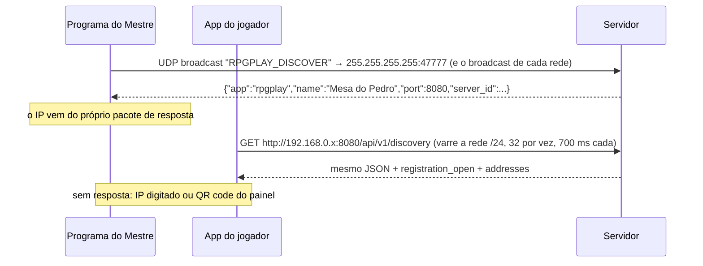

# Rede local: descoberta, portas e segurança

Como os aparelhos acham o servidor da casa e o que protege a mesa numa rede sem nuvem.

## Portas

| Porta | Protocolo | Uso |
|---|---|---|
| 8080 | TCP (HTTP + WebSocket) | API REST `/api/v1`, WebSocket da mesa `/ws/rooms/{pin}`, imagens `/media/...` e o painel do Mestre `/mestre` |
| 47777 | UDP | Responder de descoberta (só responde a quem pergunta; não fica anunciando) |

Ambas configuráveis: `RPG_PORT` e `RPG_DISCOVERY_PORT` (e `RPG_DISCOVERY_ENABLED=false` desliga o UDP).

Com firewall ativo no servidor, `sudo rpgplay-server liberar-firewall` libera as duas portas só para a sub-rede de casa (detectada por `ip -4 addr`), no ufw ou no firewalld. `sudo rpgplay-server diagnostico` confere servidor, endereço e firewall e diz o próximo passo.

No **Windows**, o instalador cria a regra "RPG Play Servidor" no Firewall do Windows: entrada liberada para o programa `rpgplay-server.exe` (TCP e UDP), **só da sub-rede local** (`remoteip=localsubnet`, em qualquer perfil de rede, inclusive quando o Windows marca o Wi-Fi como "público"). O atalho "Liberar no firewall" refaz a regra e o "Diagnóstico de rede" confere se ela existe.

## Descoberta

Três caminhos, do mais automático ao mais manual:

1. **Programa do Mestre (Electron):** broadcast UDP primeiro (≈1,5 s). Se ninguém responder (roteadores que bloqueiam broadcast), varre a rede /24 por HTTP. Lembra o último servidor e reconecta direto.
2. **App dos jogadores:** o Android/Expo não tem UDP sem módulo nativo extra, então o app descobre o próprio IP (`expo-network`) e varre a rede /24 pelo HTTP. São 254 endereços, 32 por vez; no pior caso leva uns 6 s. Cada servidor aparece na lista assim que responde.
3. **QR code:** o painel do Mestre mostra `rpgplay://join?server=http://IP:8080&pin=ABC123`. O leitor do app (ou a câmera do sistema) configura o servidor e, depois do login, já entra na mesa com o PIN.

O `server_id` (gerado uma vez e guardado em `/var/lib/rpgplay/server_id`) identifica o servidor mesmo que o IP mude. O app avisa quando o servidor escolhido é outro: trocar de servidor encerra a sessão, porque as contas são de cada servidor.

O painel monta o QR code com o endereço pelo qual foi aberto. Se foi aberto no próprio servidor (`localhost`), usa os IPs de rede que o servidor informa em `/api/v1/discovery` (`addresses`).

## Modelo de segurança

A premissa é **uma rede doméstica confiável**, sem exposição à internet.

- **Sem TLS.** Numa LAN não há como obter certificado válido sem domínio público, e certificado autoassinado faria cada aparelho reclamar. Por isso o app Android libera HTTP (`usesCleartextTraffic`). **Nunca faça redirecionamento de porta (port forwarding) da 8080 para a internet.** Para jogar à distância, use uma VPN como Tailscale ou WireGuard: os aparelhos ficam "na mesma rede" e o tráfego vai criptografado pelo túnel.
- **Contas:** senha com Argon2id, JWT de acesso de 60 min e refresh token de uso único (rotação), guardado só como hash. No celular, os tokens ficam no Android Keystore (`expo-secure-store`).
- **Segredo JWT gerado no primeiro uso** (`/var/lib/rpgplay/jwt_secret`, permissão 600). Em produção o servidor recusa subir com o segredo de desenvolvimento.
- **Cadastro:** aberto por padrão. A primeira conta vira admin. Depois que o grupo entrou, feche com `RPG_ALLOW_REGISTRATION=false`.
- **WebSocket:** o token vai na primeira mensagem, nunca na URL. Cada evento é filtrado por quem pode ver: o Mestre recebe tudo; o jogador recebe só a cena do seu boneco, nunca bonecos escondidos (nem quem está num objeto com ocupantes ocultos, exceto ele mesmo) e, dos inimigos, só nome, imagem e estado vago (`Ileso`, `Ferido`, `Muito ferido`, `Caído`). O PV numérico dos inimigos e as rolagens secretas ficam só com o Mestre.
- **Névoa e mundo:** cada jogador recebe só a exploração do **próprio** personagem. Do mapa-múndi, só a imagem liberada e as nações/facções/relações reveladas, **sem as notas secretas**. (A névoa esconde o mapa na tela; bonecos visíveis da cena ainda chegam ao app, como numa mesa física com o mapa coberto.)
- **Permissões da mesa:** só o Mestre cria cenas, peças de cenário, objetos e inimigos, envia imagens, move bonecos e objetos (REST, `token.move` e `object.move`), mexe na névoa e no mapa-múndi. Jogadores alteram o PV do próprio personagem e sobem o nível dele (o Mestre também pode, pela mesa).
- **Uploads:** mapa até 20 MB (reduzido a 4096 px no maior lado), peça de cenário até 20 MB (2048 px, PNG quando tem transparência), brasão (512 px) e retrato até 5 MB (512 px). Qualquer imagem pode ser girada no envio (`rotation`). Reencode sem EXIF/GPS, proteção contra *decompression bomb*, e a imagem só pode ser usada na mesa para a qual foi enviada.
- **Limites de frequência** em login, PIN, rolagens, dano/cura, uploads e movimentos de bonecos (o arrasto manda ~10 posições/s; o excesso é descartado e a posição final chega pelo "soltar").
- **Serviço systemd endurecido:** usuário próprio `rpgplay`, sistema de arquivos somente leitura exceto `/var/lib/rpgplay`, sem novas capacidades, `PrivateTmp`, `ProtectHome`, sem acesso a dispositivos.
- **Programa do Mestre (Electron):** `contextIsolation` + `sandbox`, sem Node na página. A ponte com o processo principal existe só na tela local de escolha do servidor, e o processo principal confere quem chama. A navegação fica presa à origem do servidor escolhido, links externos abrem no navegador e permissões (câmera, microfone, localização) são negadas.

## Onde ficam os dados

| O quê | Onde (servidor instalado por .deb) |
|---|---|
| Banco (SQLite, modo WAL) | `/var/lib/rpgplay/rpgplay.db` |
| Mapas, peças de cenário, brasões, retratos | `/var/lib/rpgplay/media/` |
| Segredo JWT, id do servidor | `/var/lib/rpgplay/jwt_secret`, `/var/lib/rpgplay/server_id` |
| Configuração | `/etc/rpgplay/server.env` |
| Programa | `/opt/rpgplay-server/` (Python embutido; não usa o Python do sistema) |
| No Windows | programa em `C:\Program Files\RPG Play Servidor`; banco, imagens, chaves e `servidor.env` em `C:\ProgramData\RPG Play\servidor` |

Postgres e Redis continuam suportados (`RPG_DATABASE_URL`, `RPG_REDIS_URL`) para quem quiser, mas não são necessários: um processo com SQLite atende uma mesa de casa com folga.
