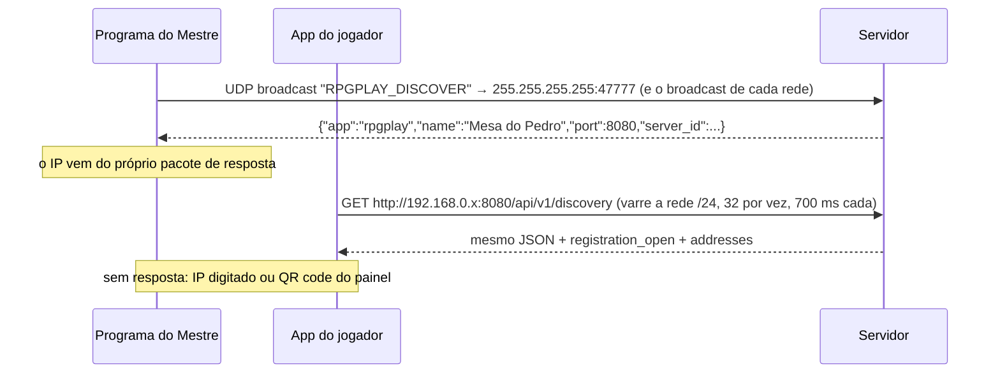
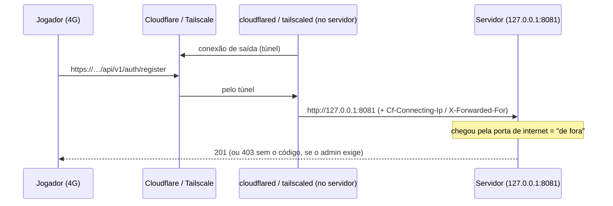

# Rede local: descoberta, portas e segurança

Como os aparelhos acham o servidor da casa e o que protege a mesa numa rede sem nuvem.

## Portas

| Porta | Protocolo | Uso |
|---|---|---|
| 8080 | TCP (HTTP + WebSocket) | API REST `/api/v1`, WebSocket da mesa `/ws/rooms/{pin}`, imagens `/media/...` e o painel do Mestre `/mestre` |
| 47777 | UDP | Responder de descoberta (só responde a quem pergunta; não fica anunciando) |
| 8081 | TCP, só em `127.0.0.1` | Porta de internet: os túneis (Cloudflare, Tailscale) entregam aqui as conexões de fora. Não precisa (e não deve) ser liberada no firewall nem no roteador |

Todas configuráveis: `RPG_PORT`, `RPG_DISCOVERY_PORT` (e `RPG_DISCOVERY_ENABLED=false` desliga o UDP) e `RPG_INTERNET_PORT` (vazio = `RPG_PORT` + 1; `RPG_INTERNET_ENABLED=false` tira a opção de internet).

Com firewall ativo no servidor, `sudo rpgplay-server liberar-firewall` libera as duas portas só para a sub-rede de casa (detectada por `ip -4 addr`), no ufw ou no firewalld. `sudo rpgplay-server diagnostico` confere servidor, endereço e firewall e diz o próximo passo.

No **Windows**, o instalador cria a regra "RPG Play Servidor" no Firewall do Windows: entrada liberada para o programa `rpgplay-server.exe` (TCP e UDP), **só da sub-rede local** (`remoteip=localsubnet`, em qualquer perfil de rede, inclusive quando o Windows marca o Wi-Fi como "público"). O atalho "Liberar no firewall" refaz a regra e o "Diagnóstico de rede" confere se ela existe.

## Descoberta

Três caminhos, do mais automático ao mais manual:

```mermaid
sequenceDiagram
  participant PC as Programa do Mestre
  participant Cel as App do jogador
  participant S as Servidor
  PC->>S: UDP broadcast "RPGPLAY_DISCOVER" → 255.255.255.255:47777 (e o broadcast de cada rede)
  S-->>PC: {"app":"rpgplay","name":"Mesa do Pedro","port":8080,"server_id":...}
  Note over PC: o IP vem do próprio pacote de resposta
  Cel->>S: GET http://192.168.0.x:8080/api/v1/discovery (varre a rede /24, 32 por vez, 700 ms cada)
  S-->>Cel: mesmo JSON + registration_open + addresses
  Note over PC,Cel: sem resposta: IP digitado ou QR code do painel
```

1. **Programa do Mestre (Electron):** broadcast UDP primeiro (≈1,5 s). Se ninguém responder (roteadores que bloqueiam broadcast), varre a rede /24 por HTTP. Lembra o último servidor e reconecta direto.
2. **App dos jogadores:** o Android/Expo não tem UDP sem módulo nativo extra, então o app descobre o próprio IP (`expo-network`) e varre a rede /24 pelo HTTP. São 254 endereços, 32 por vez; no pior caso leva uns 6 s. Cada servidor aparece na lista assim que responde.
3. **QR code:** o painel do Mestre mostra `rpgplay://join?server=http://IP:8080&pin=ABC123`. O leitor do app (ou a câmera do sistema) configura o servidor e, depois do login, abre a aba Mesas com o PIN pronto (o jogador pode criar o personagem antes de entrar). Pela internet o link leva também `&code=` (código de acesso), e o convite é uma página https do próprio servidor (`/entrar?pin=…&code=…`), clicável em qualquer mensageiro, com um botão que abre esse link no app.

O `server_id` (gerado uma vez e guardado em `/var/lib/rpgplay/server_id`) identifica o servidor mesmo que o IP mude. O app avisa quando o servidor escolhido é outro: trocar de servidor encerra a sessão, porque as contas são de cada servidor.

O painel monta o QR code com o endereço pelo qual foi aberto. Se foi aberto no próprio servidor (`localhost`), usa os IPs de rede que o servidor informa em `/api/v1/discovery` (`addresses`).

## Modelo de segurança

A premissa é **uma rede doméstica confiável**. A internet só entra quando o admin liga o acesso pela internet (seção abaixo), e sempre por um túnel https.

- **Sem TLS na rede de casa.** Numa LAN não há como obter certificado válido sem domínio público, e certificado autoassinado faria cada aparelho reclamar. Por isso o app Android libera HTTP (`usesCleartextTraffic`). **Nunca faça redirecionamento de porta (port forwarding) da 8080 para a internet**: para jogar à distância, use o acesso pela internet do próprio servidor (https) ou uma VPN.
- **Contas:** senha com Argon2id, JWT de acesso de 60 min e refresh token de uso único (rotação), guardado só como hash. No celular, os tokens ficam no Android Keystore (`expo-secure-store`).
- **Segredo JWT gerado no primeiro uso** (`/var/lib/rpgplay/jwt_secret`, permissão 600). Em produção o servidor recusa subir com o segredo de desenvolvimento.
- **Cadastro:** aberto por padrão. A primeira conta vira admin. Depois que o grupo entrou, feche com `RPG_ALLOW_REGISTRATION=false`.
- **WebSocket:** o token vai na primeira mensagem, nunca na URL. Cada evento é filtrado por quem pode ver: o Mestre recebe tudo; o jogador recebe só a cena do seu boneco, nunca bonecos escondidos (nem quem está num objeto com ocupantes ocultos, exceto ele mesmo) e, dos inimigos, só nome, imagem e estado vago (`Ileso`, `Ferido`, `Muito ferido`, `Caído`). O PV numérico dos inimigos e as rolagens secretas ficam só com o Mestre.
- **Névoa e mundo:** cada jogador recebe só a exploração do **próprio** personagem. Do mapa-múndi, só a imagem liberada e as nações/facções/relações reveladas, **sem as notas secretas**. (A névoa esconde o mapa na tela; bonecos visíveis da cena ainda chegam ao app, como numa mesa física com o mapa coberto.)
- **Permissões da mesa:** só o Mestre cria cenas, peças de cenário, objetos e inimigos, envia imagens, move bonecos e objetos (REST, `token.move` e `object.move`), mexe na névoa e no mapa-múndi. Jogadores alteram o PV do próprio personagem e sobem o nível dele (o Mestre também pode, pela mesa).
- **Uploads:** mapa até 20 MB (reduzido a 4096 px no maior lado), peça de cenário até 20 MB (2048 px, PNG quando tem transparência), brasão (512 px) e retrato até 5 MB (512 px). Qualquer imagem pode ser girada no envio (`rotation`). Reencode sem EXIF/GPS, proteção contra *decompression bomb*, e a imagem só pode ser usada na mesa para a qual foi enviada.
- **Limites de frequência** em login, PIN, rolagens, dano/cura, uploads e movimentos de bonecos (o arrasto manda ~10 posições/s; o excesso é descartado e a posição final chega pelo "soltar").
- **Serviço systemd endurecido:** usuário próprio `rpgplay`, sistema de arquivos somente leitura exceto `/var/lib/rpgplay`, sem novas capacidades, `PrivateTmp`, `ProtectHome`, sem acesso a dispositivos.
- **Programa do Mestre (Electron):** `contextIsolation` + `sandbox`, sem Node na página. A ponte com o processo principal existe só na tela local de escolha do servidor, e o processo principal confere quem chama. A navegação fica presa à origem do servidor escolhido, links externos abrem no navegador e permissões (câmera, microfone, localização) são negadas.

## Acesso pela internet

Ligado pelo admin no painel (globo "Internet"), de graça e sem abrir portas no roteador:

- **Link rápido:** o servidor roda `cloudflared tunnel --url http://127.0.0.1:8081` (Cloudflare Quick Tunnel, sem conta). O `cloudflared` vem do PATH ou é baixado na primeira vez, do Release oficial da Cloudflare no GitHub, para `{dados}/bin`. O link `https://…trycloudflare.com` sai da saída do programa e muda a cada abertura do túnel. Se o túnel cair, o servidor reabre sozinho (espera crescente até 60 s).
- **Link fixo:** Tailscale Funnel. O comando `rpgplay-server internet fixo` (root no Linux) roda `tailscale funnel --bg 8081`. O servidor descobre o nome em `tailscale status --json` (`Self.DNSName`) e confere se o link chega nele mesmo (`/api/v1/discovery` com o mesmo `server_id`).
- O estado fica em `{dados}/remote.json` (modo, código de acesso e se ele é exigido, último link fixo e o link atual), com permissão 600. Ligado, o túnel volta sozinho quando o servidor reinicia.

```mermaid
sequenceDiagram
  participant J as Jogador (4G)
  participant T as Cloudflare / Tailscale
  participant C as cloudflared / tailscaled (no servidor)
  participant S as Servidor (127.0.0.1:8081)
  C->>T: conexão de saída (túnel)
  J->>T: https://…/api/v1/auth/register
  T->>C: pelo túnel
  C->>S: http://127.0.0.1:8081 (+ Cf-Connecting-Ip / X-Forwarded-For)
  Note over S: chegou pela porta de internet = "de fora"
  S-->>J: 201 (ou 403 sem o código, se o admin exige)
```

**Como o servidor sabe que é "de fora":** o `rpgplay-server serve` escuta em duas portas, a da rede de casa (`0.0.0.0:8080`) e a de internet (`127.0.0.1:8081`, só a própria máquina alcança). Tudo o que chega pela porta de internet, ou traz os cabeçalhos que os túneis sempre colocam (`Cf-Connecting-Ip`, `Tailscale-Funnel-Request`), é tratado como vindo da internet (`app/core/origin.py`). Um IP público sozinho não conta: com IPv6, os celulares da própria casa têm IP público.

**O que muda para quem vem de fora:**

- **Cadastro:** livre por padrão (a conta e o personagem não dependem de mesa; a proteção é a aprovação de entrada). O admin pode exigir o **código de acesso** (`XXXX-XXXX`, 8 caracteres do alfabeto do PIN, sem 0/O/1/I; comparação em tempo constante, sem diferenciar maiúsculas nem o traço). Com a internet desligada, o cadastro de fora é recusado. A primeira conta (admin) nunca pode ser criada de fora.
- **Aprovação de entrada nas mesas:** ao ligar a internet, as mesas abertas passam a pedir aprovação, e as novas já nascem assim (o Mestre desliga por mesa). Quem entra pelo PIN recebe `409 join_pending` e espera; o Mestre vê o pedido ao vivo (`join.requests` pelo WebSocket) e aceita ou recusa. Recusado, o jogador só pode pedir de novo depois de 10 minutos. A consulta da sala de espera (`GET /rooms/join-status`) responde "sala não encontrada" para quem não pediu, então não serve para descobrir PINs.
- **Limites:** cadastro de fora com 10 tentativas por IP a cada 10 minutos (o IP vem do `Cf-Connecting-Ip`); login de fora com 20 tentativas por conta a cada 5 minutos, somando todos os IPs (além do limite por IP e conta de sempre).
- **Descoberta pela internet** não mostra os IPs da casa e avisa o app (e o painel) quando o cadastro pede o código (`access_code_required`).
- **O painel do Mestre** também abre pelo link (com login). O botão de internet só aparece para o admin; Mestres veem o link (e o código, se exigido) em "Conectar celulares".

**Limites dos serviços grátis:** o Quick Tunnel da Cloudflare é para testes, sem garantia de funcionamento e com até 200 requisições simultâneas (sobra para uma mesa de RPG). O Funnel do Tailscale é grátis para uso pessoal. Nenhum dos dois exige cartão de crédito.

## Onde ficam os dados

| O quê | Onde (servidor instalado por .deb) |
|---|---|
| Banco (SQLite, modo WAL) | `/var/lib/rpgplay/rpgplay.db` |
| Mapas, peças de cenário, brasões, retratos | `/var/lib/rpgplay/media/` |
| Segredo JWT, id do servidor | `/var/lib/rpgplay/jwt_secret`, `/var/lib/rpgplay/server_id` |
| Acesso pela internet (modo, código de acesso e se ele é exigido, links) e o `cloudflared` baixado | `/var/lib/rpgplay/remote.json`, `/var/lib/rpgplay/bin/` |
| Configuração | `/etc/rpgplay/server.env` |
| Programa | `/opt/rpgplay-server/` (Python embutido; não usa o Python do sistema) |
| No Windows | programa em `C:\Program Files\RPG Play Servidor`; banco, imagens, chaves e `servidor.env` em `C:\ProgramData\RPG Play\servidor` |

Postgres e Redis continuam suportados (`RPG_DATABASE_URL`, `RPG_REDIS_URL`) para quem quiser, mas não são necessários: um processo com SQLite atende uma mesa de casa com folga.
