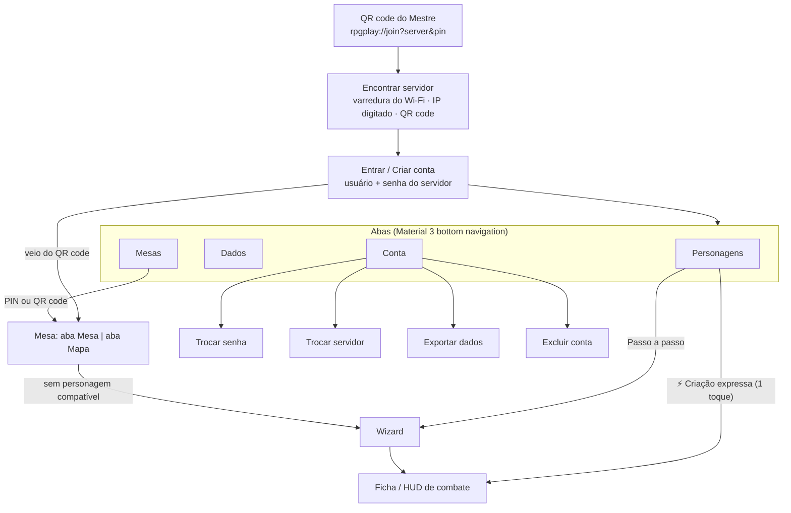

# Fluxos de UX

Princípio do produto: **um personagem jogável em menos de 1 minuto** e, para quem quer detalhe, um wizard que nunca obriga a abrir o livro de regras.

## Mapa de navegação (app dos jogadores)

O Mestre usa o **painel do Mestre** no PC (programa RPG Play Mestre ou navegador em `/mestre`): login → lista de mesas → mesa virtual.

## A. Criação de personagem

Dois caminhos, porque o problema é lentidão:

1. **Criação expressa**: nome e sistema, depois um toque. O servidor sorteia raça/classe/antecedente, distribui o arranjo padrão pela prioridade da classe, aplica os bônus, calcula PV e espaços de magia e devolve a ficha pronta (`POST /characters/quick`). Tudo continua editável.
2. **Wizard** (`character/new`), um passo por tela, com barra de progresso "Passo X de Y":

| Passo | O que o usuário faz | Detalhes de UX |
|---|---|---|
| Sistema | Escolhe entre os sistemas disponíveis | Pulado se vier de uma mesa (usa o sistema da sala) |
| Identidade | Nome e retrato | Galeria (Photo Picker, sem permissão) ou câmera (explicação antes de pedir). Corte quadrado nativo e redução para 512 px **no aparelho** |
| Raça / Espécie | Toca num card | Card com descrição de 1 linha e chips de bônus e deslocamento. "Personalizado" em sistemas que permitem. Meio-Elfo: chips para os 2 atributos +1 |
| Classe | Toca num card | Chips: dado de vida e atributos principais |
| Atributos | **Auto** (1 toque), Rolar (4d6kh3 no servidor, com os dados destacados em dourado/vermelho), Arranjo (toque em 2 atributos para trocar), Pontos (orçamento restante ao vivo), Manual | Mostra o valor final + modificador + bônus |
| Antecedente | Card + bônus (+2/+1 ou +1/+1/+1 na regra 2024) | Chips com as combinações válidas: impossível escolher errado |
| Revisão | Confere e conclui | Lista o que falta. O botão fica desabilitado até estar completo |

**Autosave**: cada passo salva o rascunho (`PATCH /characters/{id}`, incluindo `wizard_step`). Se o app fechar, o card "Rascunho · passo N" na lista reabre exatamente onde parou.

## B. Rolagem de dados

- **Montar a rolagem sem digitar**: chips D2…D1000, quantidade, modificador, Vantagem/Desvantagem no d20. Um campo livre aceita notação (`4d6kh3`, `1d8+1d6+2`).
- **Gesto**: arrastar e soltar joga os dados na direção e força do gesto. Um toque joga em direção aleatória. O botão "Rolar" faz o mesmo e é acessível ao TalkBack.
- **Física**: os dados quicam nas bordas e entre si (restituição 0,62, atrito), com um toque háptico suave a cada batida na parede (limitado a ~11/s). Enquanto rolam, as faces "giram".
- **Revelação**: quando param, mostram o resultado do servidor com um "pop", os descartados (kh/kl) ficam translúcidos e o total aparece grande com o rótulo do tier.
- **Emoção por faixa**:
  - *Falha crítica*: o dado racha (linhas vermelhas), a bandeja treme, pisca uma vinheta vermelha, caem brasas escuras, soa um impacto seco e vêm dois pulsos de vibração.
  - *Baixo*: vinheta âmbar fraca, baque abafado, tremor leve.
  - *Alto*: faíscas douradas e um sino.
  - *Crítico*: explosão de luz no dado, confete, fanfarra e vibração de sucesso.
- **D6 "padrão"** mostra os pontos e **D6 "numérico"** mostra o número. Dados sem sólido comum (d5, d16, d24, d30, d60, d1000) viram "orbes" numerados. D2 é uma moeda.

## C. Ficha dinâmica (HUD de combate)

- **Barra de HP**:
  - Dano: queda rápida, com a faixa vermelho-escura "sangrando" atrás e drenando, tremor proporcional ao golpe e flash vermelho.
  - Cura: faixa ciano na frente, subida com mola, brilho verde e partículas de luz.
  - PV temporário: faixa azul de escudo.
  - Abaixo de 25%: contorno pulsando como batimento.
- **Botões rápidos** −1/−5/−10 e +1/+5/+10, mais um campo com botões de dano, cura e temporário.
- **Espaços de magia**: bolinhas que se apagam ao usar e voltam no descanso longo.
- **Habilidades**: botão cheio enquanto há usos. Quando acabam, fica **cinza** com ampulheta e "recarrega no descanso curto/longo".
- **Inventário**: barra de carga (verde → âmbar a 75% → vermelha e "SOBRECARREGADO") calculada pelo sistema (FOR×15 lb na 5ª edição; fixa no Genérico).

## D. Mesa sincronizada

- **Mestre (PC):** Nova mesa → escolhe o **sistema de regras** (fica fixo na campanha) e o nome → recebe o **PIN** (6 caracteres sem 0/O/1/I, para ditar em voz alta) e o **QR code** em "Conectar celulares".
- **Jogador:** lê o QR code (configura o servidor e entra na mesa depois do login) ou digita o PIN, e escolhe um personagem **do mesmo sistema**. Sem personagem compatível, "Criar um agora" abre o wizard já com o sistema da mesa.
- **Aba Mesa (celular):** grupo com a mini barra de PV de cada personagem e status online, rolagem compartilhada (com opção "só o Mestre vê") e log da sessão.
- **Tudo ao vivo no painel do Mestre:** rolagens (a última aparece grande, com a cor do resultado), dano e cura no log e nas barras de PV, e quem está conectado.
- **Campanhas:** nada expira. "Arquivar" guarda a mesa, e "Reabrir campanha" volta com cenas, inimigos e log.
- **Conexão instável:** aviso "Reconectando…" e reconexão automática, com o estado atual reenviado.

## E. Mesa virtual (painel do Mestre)

Layout em três colunas, pensado para monitor de PC:

| Esquerda | Centro | Direita |
|---|---|---|
| **Grupo** (personagens, PV, online, em que cena está) e **Inimigos** (PV, CA, estado). Arrastar para o mapa ou botão "colocar nesta cena". "Novo inimigo" com imagem, PV, CA, atributos do sistema da mesa, notas e quantidade | **Abas de cenas** e **mapa** (Konva): roda do mouse = zoom no cursor, arrastar o fundo = mover, arrastar boneco = mover com encaixe na grade (Alt solta livre), botão direito = esconder/mostrar, trazer para a frente, tamanho (½ a 4 casas), mover para outra cena, tirar do mapa. Soltar um arquivo de imagem no mapa troca o mapa da cena | **Detalhes ao vivo** do boneco selecionado: ficha do personagem (atributos clicáveis para rolar, magias com usos, inventário e carga, condições, anotações), PV grande com Dano/Cura/Temp. Nos inimigos: CA, "Jogadores veem: Ferido", rolagens **secretas** por padrão, editar e apagar. Abaixo: **log da sessão** e **rolador** (d4…d100, notação livre, secreta) |

- **Bonecos:** redondos, com retrato, **anel** (verde-água = grupo, vermelho = inimigo), **arco de PV** em volta (verde → âmbar → vermelho) e nome. Escondidos ficam translúcidos, com anel tracejado e "(escondido)".
- **Grupo separado:** "Nova cena", depois botão direito no boneco → "Mover para a cena", ou "Trazer o grupo todo para esta cena". O número na aba mostra quantos personagens estão em cada cena.
- **Contas:** o admin redefine senhas pelo ícone de contas na lista de mesas (não há e-mail de recuperação).

## F. Mapa do jogador (celular)

- Aba **Mapa** dentro da mesa: a cena onde está o personagem do jogador, **só leitura**. Pinça = zoom, arrastar = mover, toque duplo = enquadrar de novo.
- O **boneco do próprio jogador** tem anel dourado. Tocar num boneco mostra um cartão: personagem do grupo com a barra de PV animada; inimigo com nome, imagem e o **estado vago** (Ileso / Ferido / Muito ferido / Caído). Inimigos caídos aparecem apagados.
- Os bonecos andam em tempo real enquanto o Mestre arrasta. Quando o Mestre leva o personagem para outra cena, o mapa troca sozinho e aparece o aviso "O Mestre levou você para outra cena".
- Bonecos escondidos e cenas onde o jogador não está nunca chegam ao celular.

## Material Design 3 e acessibilidade

- App: `react-native-paper` (MD3): cards, segmented buttons, chips, dialogs, snackbar e FAB-like actions, com tema escuro "dark fantasy" (primária dourada, secundária carmim) e tema claro.
- Alvos ≥ 48 dp, rótulos de acessibilidade em todos os botões só de ícone, `accessibilityLiveRegion` no resultado dos dados.
- "Remover animações" do sistema (`useReducedMotion`) desliga tremores, partículas e pulsação. As mudanças de valor continuam visíveis.
- Painel do Mestre: MUI com tema escuro de taverna (dourado), sem fontes nem scripts externos (funciona sem internet), botões só de ícone com rótulo acessível e dicas (tooltips).
